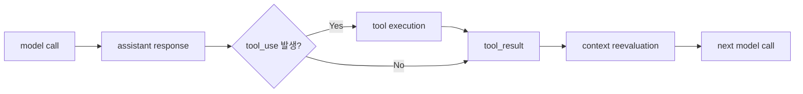

# 유출된 Claude Code 소스코드 누리기

`docs/e2e-analysis.md`, `docs/e2e-analysis-v2.md`, 그리고 관련 구현 파일을 바탕으로 다시 짠 발표용 풀 슬라이드 초안이다.  
의도적으로 슬라이드를 줄이지 않았다. 일단 쭉 펼쳐두고, 이후 발표 길이에 맞게 합치거나 덜어내는 전제로 작성했다.

## 발표 기본 톤

- 이 deck은 Claude Code의 "공식 taxonomy"를 설명하는 자료가 아니라, 현재 소스코드 inspection을 바탕으로 한 working model 설명이다.
- 목표는 "Claude Code를 재현하자"가 아니라, "AX Platform 설계에 도움이 되는 힌트를 뽑아오자"다.
- 이번 deck의 메인 챕터는 `Tool System`이고, `Reminder System`이 2순위 주인공이다.
- `Memory`, `Compact`, `WebSearch + WebFetch`는 각각 다른 종류의 supporting evidence / deep dive로 배치한다.

## Slide 1. Cover

### 슬라이드 문구

- 제목: 유출된 Claude Code 소스코드 누리기
- 부제: Claude Code runtime을 뜯어보며 AX Platform 설계 힌트를 훔쳐오기

### 발표자가 말할 포인트

- 오늘 얘기는 "Claude Code 기능 소개"가 아니다.
- 코드를 실제로 뜯어보면, 좋은 agent harness가 무엇으로 이루어지는지 보인다.
- 특히 prompt보다 runtime, runtime보다도 tool 설계가 핵심이라는 점을 이야기하고 싶다.

---

## Slide 2. 왜 이걸 뜯어보는가

### 슬라이드 문구

- Harness Claude Code를 분석해서 AX Platform 설계/개발/정책 판단에 힌트를 얻는다.
- Claude Code를 더 잘 쓰기 위해서도 내부 동작을 이해할 가치가 있다.
- 다만 오늘 설명은 source inspection 기반 working model이다.

### 발표자가 말할 포인트

- 청중이 엔지니어링 역량이 높기 때문에, 기능 데모보다 구조를 보는 편이 더 가치 있다.
- "왜 잘 되는가"를 보면 우리 쪽 설계에도 직접 번역할 수 있다.

---

## Slide 3. 오늘의 주장

### 슬라이드 문구

- Claude Code의 강점은 단일 system prompt가 아니다.
- 긴 작업을 유지시키는 runtime engineering과 tool architecture가 핵심이다.
- 특히 `tool = 외부 호출기`라는 관점으로는 이 시스템을 설명할 수 없다.

### 발표자가 말할 포인트

- 이 발표의 메인 메시지는 "tool이 중요하다"가 아니다.
- 더 정확히는 "복잡한 business logic을 모델이 선택 가능한 행동 구조로 드러낸다"는 점이 중요하다.
- 그리고 그 결과가 런타임 상태, permission, reminder, artifact와 연결된다.

---

## Slide 4. Claude Code E2E Working Model

### 슬라이드 문구


### 발표자가 말할 포인트

- 이 5단 구조는 코드에 박혀 있는 공식 단계명이 아니라, 현재 구현을 읽을 때 가장 설명력이 높은 working model이다.
- 뒤의 모든 이야기, 특히 tool/reminder/compact 이야기는 사실상 `컨텍스트 조립`과 `에이전틱 루프` 안에서 일어난다.

### 근거

- `docs/e2e-analysis-v2.md`

---

## Slide 5. E2E에서 정말 중요한 두 구간

### 슬라이드 문구

- `컨텍스트 조립`: 이번 호출에 무엇을 실을지 runtime이 편집하는 단계
- `에이전틱 루프`: 모델 호출, tool 실행, 상태 재주입이 반복되는 단계

### 발표자가 말할 포인트

- agent의 품질은 단순히 "큰 context window"에서 나오지 않는다.
- 매 step마다 무엇을 다시 넣고, 무엇을 버리고, 무엇을 tool 결과로 다시 surface하느냐가 중요하다.
- 그래서 곧바로 Tool System으로 들어가기 전에 loop를 먼저 봐야 한다.

---

## Slide 6. Agentic Loop는 Tool System을 위한 무대다

### 슬라이드 문구



### 발표자가 말할 포인트

- tool은 한 번 호출되고 끝나는 함수가 아니다.
- 실행 결과가 `tool_result`, attachment, reminder, artifact, runtime state 변화로 남고 다음 step에 영향을 준다.
- 즉 Claude Code는 "tool calling agent"라기보다 "tool-mediated runtime"에 가깝다.

### 근거

- `docs/e2e-analysis.md`
- `docs/e2e-analysis-v2.md`

---

## Slide 7. 오늘의 메인 챕터: Tool System

### 슬라이드 문구

- Tool은 외부 API를 부르는 보조 기능이 아니다.
- Tool은 모델이 선택할 수 있는 행동 단위다.
- Claude Code는 복잡한 business logic을 코드 분기만으로 감추지 않고 tool 구조로 드러낸다.

### 발표자가 말할 포인트

- 보통 tool을 "search", "read", "edit" 같은 IO capability로만 본다.
- 그런데 Claude Code는 `EnterPlanMode`, `TodoWrite`, `TaskCreate`, `VerifyPlanExecution`처럼 runtime 자체를 조직하는 동작도 tool로 만든다.
- 이게 Harness Claude Code를 설명하는 핵심이라고 본다.

---

## Slide 8. Tool은 세 가지 표면에 동시에 걸쳐 있다

### 슬라이드 문구

- 모델 표면: 모델이 어떤 행동을 선택할 수 있는가
- 런타임 표면: 호출 결과가 어떤 상태 변화를 일으키는가
- UX 표면: 사용자가 어떤 절차와 피드백을 경험하는가

### 발표자가 말할 포인트

- 같은 tool 호출이라도 사용자에게 보이는 것, transcript에 남는 것, 다음 모델 호출에 다시 들어가는 것이 다를 수 있다.
- 그래서 tool은 함수 정의이면서 동시에 runtime contract다.
- 이 관점이 없으면 `EnterPlanMode`, `Reminder`, `Task tool`, `WebFetch`의 의미가 잘 안 보인다.

### 근거

- `docs/e2e-analysis.md`
- `src/services/tools/toolExecution.ts`
- `src/services/tools/toolOrchestration.ts`

---

## Slide 9. 사례 1: EnterPlanMode는 런타임 상태를 바꾸는 Tool이다

### 슬라이드 문구

- `EnterPlanMode`는 외부 호출이 아니라 session posture transition이다.
- tool 실행 결과로 mode와 permission context가 바뀐다.

### 발표자가 말할 포인트

- 이 도구가 중요한 이유는 "계획 모드로 들어간다"는 텍스트 때문이 아니다.
- 실제로 런타임이 `handlePlanModeTransition(...)`, `prepareContextForPlanMode(...)`, `applyPermissionUpdate(...)`를 거쳐 세션 상태를 바꾼다.
- 즉 tool이 world를 조작하는 게 아니라 runtime itself를 조작한다.

### 코드 근거

- `src/tools/EnterPlanModeTool/EnterPlanModeTool.ts`

### 넣을 스니펫 후보

```ts
handlePlanModeTransition(appState.toolPermissionContext.mode, 'plan')

context.setAppState(prev => ({
  ...prev,
  toolPermissionContext: applyPermissionUpdate(
    prepareContextForPlanMode(prev.toolPermissionContext),
    { type: 'setMode', mode: 'plan', destination: 'session' },
  ),
}))
```

---

## Slide 10. EnterPlanMode가 주는 설계 힌트

### 슬라이드 문구

- mode / permission / state transition도 tool로 설계할 수 있다.
- 정책과 절차를 모델 바깥 하드코딩 분기만으로 풀지 않아도 된다.

### 발표자가 말할 포인트

- 이 패턴은 Sandbox, Tenant, Auth, Permission, Scope 같은 영역에도 응용 가능하다.
- 예를 들어 "작업 환경을 전환한다", "권한이 더 강한 lane으로 들어간다", "검증 모드로 전환한다" 같은 것도 tool로 드러낼 수 있다.
- 중요한 건 그 tool이 실제로 runtime state와 연결되어야 한다는 점이다.

---

## Slide 11. Tool 결과는 호출 직후 사라지지 않는다

### 슬라이드 문구

- 어떤 결과는 `tool_result`로 바로 다음 모델 호출에 들어간다.
- 어떤 결과는 attachment / reminder로 다시 surfaced된다.
- 어떤 결과는 AppState나 file-backed artifact로 남았다가 필요할 때 다시 읽힌다.

### 발표자가 말할 포인트

- Claude Code에서 tool은 "RPC 호출"이 아니라 "지속성을 가진 사건"에 가깝다.
- 이 구조가 있기 때문에 장기 세션에서도 작업 절차가 끊어지지 않는다.

### 근거

- `docs/e2e-analysis.md`

---

## Slide 12. 2순위 주인공: Reminder System

### 슬라이드 문구

- Claude Code는 모델이 기억하길 기대하지 않는다.
- 중요한 상태를 reminder로 기계적으로 다시 주입한다.

### 발표자가 말할 포인트

- 이건 단순 "주의 문구"가 아니다.
- runtime이 상태를 계산해서 `<system-reminder>` 또는 attachment 기반 메시지로 다음 step에 다시 넣어주는 구조다.
- 즉 기억 문제를 모델에게 떠넘기지 않고, 시스템이 개입한다.

### 근거

- `docs/e2e-analysis.md`
- `docs/e2e-analysis-v2.md`
- `src/constants/prompts.ts`

---

## Slide 13. Reminder는 어떤 식으로 주입되는가

### 슬라이드 문구

- `todo_reminder`
- `task_reminder`
- `verify_plan_reminder`
- `compaction_reminder`
- `queued_command`
- `critical_system_reminder`

### 발표자가 말할 포인트

- reminder는 한 종류가 아니다.
- workflow state, plan verification, compaction 이후 주의사항, mid-flight user correction까지 서로 다른 이유로 재주입된다.
- 중요한 건 "무조건 매 turn 다 넣는 것"이 아니라, 조건부로 계산해서 넣는다는 점이다.

### 코드 근거

- `src/utils/attachments.ts`
- `src/utils/messages.ts`

---

## Slide 14. Reminder Deep Dive: Todo / Task Reminder

### 슬라이드 문구

- tool을 오래 안 쓰면 runtime이 먼저 잊음 방지 장치를 건다.
- reminder 안에는 현재 todo/task 내용도 같이 실린다.

### 발표자가 말할 포인트

- `attachments.ts`를 보면 최근 몇 assistant turn 동안 `TodoWrite`나 `TaskCreate/TaskUpdate`가 안 쓰였는지 계산한다.
- 임계치를 넘으면 현재 목록을 실은 `todo_reminder` 또는 `task_reminder` attachment를 만든다.
- 그리고 `messages.ts`에서 이 attachment를 `<system-reminder>`로 감싼 user-like meta message로 바꿔 다음 모델 호출에 넣는다.

### 코드 근거

- `src/utils/attachments.ts`
- `src/utils/messages.ts`

### 넣을 스니펫 후보 1

```ts
if (
  turnsSinceLastTodoWrite >= TODO_REMINDER_CONFIG.TURNS_SINCE_WRITE &&
  turnsSinceLastReminder >= TODO_REMINDER_CONFIG.TURNS_BETWEEN_REMINDERS
) {
  return [{ type: 'todo_reminder', content: todos, itemCount: todos.length }]
}
```

### 넣을 스니펫 후보 2

```ts
let message = `The TodoWrite tool hasn't been used recently...`
...
return wrapMessagesInSystemReminder([
  createUserMessage({ content: message, isMeta: true }),
])
```

---

## Slide 15. Reminder의 진짜 의미

### 슬라이드 문구

- workflow state를 항상 context에 통째로 들고 다니지 않는다
- 필요할 때 읽고, 잊을 때 reminder를 붙이고, 상태가 바뀌면 notification으로 알려준다

### 발표자가 말할 포인트

- 이게 굉장히 중요하다.
- naive하게는 "todo/task/plan 전부를 매 turn system prompt에 넣자"가 되기 쉽다.
- Claude Code는 그렇게 하지 않고, state를 artifact로 유지하면서 필요할 때만 resurfacing한다.
- 이것이 context budget과 운영 안정성을 동시에 맞추는 방식이다.

---

## Slide 16. Case Study: Compact는 요약 한 방이 아니다

### 슬라이드 문구

- Claude Code의 compact는 단일 summarization 기능이 아니다.
- deterministic shrink와 model summarization이 분리되어 있다.
- compaction 이후에도 필요한 것들은 다시 reinject된다.

### 발표자가 말할 포인트

- `microcompact` 단계에서 compactable tool 결과를 줄이고, 캐시/토큰 예산 관련 처리를 먼저 한다.
- 이후에도 부족하면 대화 자체를 summarization하는 compaction으로 간다.
- 게다가 compact 뒤에 skill, file, plan 같은 맥락을 다시 복원하는 post-compact 로직이 있다.

### 코드 근거

- `src/commands/compact/compact.ts`
- `src/services/compact/microCompact.ts`
- `src/services/compact/compact.ts`

---

## Slide 17. Compact Deep Dive: 세계 최고 수준 harness의 내부 공학

### 슬라이드 문구

- media strip
- reinjected attachment strip
- compactable tool result shrink
- PTL(prompt-too-long) retry
- post-compact restore budget

### 발표자가 말할 포인트

- 이건 "컨텍스트가 길어지면 요약해" 수준이 아니다.
- 이미지/문서를 먼저 marker로 치환하고, 어차피 나중에 다시 넣을 attachment는 summarizer에 먹이지 않으며, tool result clearing도 별도로 한다.
- 그리고 compact 호출 자체가 prompt-too-long에 걸릴 수 있다는 전제까지 코드에 들어 있다.
- 구현 디테일의 두께 자체가 harness maturity를 보여준다.

### 넣을 스니펫 후보

```ts
export const POST_COMPACT_MAX_FILES_TO_RESTORE = 5
export const POST_COMPACT_TOKEN_BUDGET = 50_000
export const POST_COMPACT_MAX_TOKENS_PER_FILE = 5_000
```

```ts
const COMPACTABLE_TOOLS = new Set<string>([
  FILE_READ_TOOL_NAME,
  ...SHELL_TOOL_NAMES,
  GREP_TOOL_NAME,
  GLOB_TOOL_NAME,
  WEB_SEARCH_TOOL_NAME,
  WEB_FETCH_TOOL_NAME,
  FILE_EDIT_TOOL_NAME,
  FILE_WRITE_TOOL_NAME,
])
```

---

## Slide 18. Deep Dive: WebSearch는 그냥 검색 API wrapper가 아니다

### 슬라이드 문구

- `WebSearch`는 최신 정보 탐색을 위한 별도 search wrapper다.
- query freshness, domain filtering, source discipline이 프롬프트/결과 구조에 같이 들어 있다.

### 발표자가 말할 포인트

- 구현을 보면 `allowed_domains`, `blocked_domains`, `max_uses: 8` 같은 운영 제한이 있다.
- prompt에는 "현재 연도를 반드시 search query에 넣어라", "답변 끝에 Sources를 넣어라" 같은 사용 규율이 들어 있다.
- 결과도 raw event stream이 아니라 정리된 `tool_result` shape로 다시 모델 입력에 들어간다.

### 코드 근거

- `src/tools/WebSearchTool/WebSearchTool.ts`
- `src/tools/WebSearchTool/prompt.ts`

---

## Slide 19. Deep Dive: WebFetch는 fetch가 아니라 guarded extraction tool이다

### 슬라이드 문구

- 입력은 `url`만이 아니라 `url + prompt`
- HTML을 markdown으로 정규화
- 소형 모델로 extraction
- redirect / domain permission / authenticated URL 경고까지 포함

### 발표자가 말할 포인트

- 이 tool은 단순 GET이 아니다.
- 권한 체크가 hostname 단위 rule과 연결돼 있고, preapproved host 개념도 있다.
- 다른 host로 redirect되면 자동으로 따라가지 않고, 새 `WebFetch`를 다시 호출하라고 돌려준다.
- prompt에서도 "authenticated/private URL이면 specialized MCP tool을 먼저 찾아라"라고 못 박는다.

### 코드 근거

- `src/tools/WebFetchTool/WebFetchTool.ts`
- `src/tools/WebFetchTool/prompt.ts`
- `src/tools/WebFetchTool/utils.ts`

### 넣을 스니펫 후보

```ts
const ruleContent = webFetchToolInputToPermissionRuleContent(input)
...
return {
  behavior: 'ask',
  message: `Claude requested permissions to use ${WebFetchTool.name}...`,
}
```

```ts
if (redirectChecker(url, redirectUrl)) {
  return getWithPermittedRedirects(redirectUrl, signal, redirectChecker, depth + 1)
} else {
  return { type: 'redirect', originalUrl: url, redirectUrl, statusCode: ... }
}
```

---

## Slide 20. 이 deep dive가 주는 메시지

### 슬라이드 문구

- 좋은 tool은 capability만 주지 않는다.
- query quality, filtering, normalization, guardrail을 함께 캡슐화한다.

### 발표자가 말할 포인트

- 우리 팀도 검색/웹 fetch 류를 구현해봤기 때문에 이 부분이 특히 비교 포인트가 된다.
- 중요한 건 "모델이 똑똑하게 하겠지"가 아니라, 좋은 동작이 나오도록 tool 안쪽에 business logic을 많이 심어둔다는 점이다.
- 결국 Claude Code의 품질은 model quality와 runtime quality의 합이다.

---

## Slide 21. 보조 챕터: Memory는 다른 종류의 persistence layer다

### 슬라이드 문구

- Reminder는 현재 작업을 안 잊게 하는 장치
- Memory는 미래 대화에도 쓸 만한 비복원성 정보를 남기는 장치

### 발표자가 말할 포인트

- memory는 task/plan/todo와 같은 workflow state 저장소가 아니다.
- 현재 프로젝트 상태에서 다시 유도 가능한 정보는 memory에 저장하지 말라고 hardcoded rule이 있다.
- 즉 "무엇이든 저장하는 메모장"이 아니라, 장기 persistence 계층이다.

### 코드 근거

- `docs/e2e-analysis.md`
- `src/memdir/memoryTypes.ts`
- `src/services/extractMemories/prompts.ts`

---

## Slide 22. Memory Taxonomy + File Format

### 슬라이드 문구

- taxonomy: `user`, `feedback`, `project`, `reference`
- file format: frontmatter + body
- `MEMORY.md`는 인덱스이지, 본문 저장소가 아니다

### 발표자가 말할 포인트

- `memoryTypes.ts`에는 저장해야 할 것과 저장하지 말아야 할 것이 매우 구체적으로 적혀 있다.
- extraction prompt를 보면 각 memory를 자기 파일로 저장하고, `MEMORY.md`에는 짧은 포인터만 추가하라고 한다.
- 이건 메모리 시스템이 "검색 가능한 durable store"로 설계되어 있다는 뜻이다.

### 넣을 스니펫 후보

```md
---
name: {{memory name}}
description: {{one-line description}}
type: {{user | feedback | project | reference}}
---

{{memory content}}
```

### 코드 근거

- `docs/e2e-analysis.md`
- `src/services/extractMemories/prompts.ts`

---

## Slide 23. Workflow Artifact 예시도 잠깐 짚고 넘어가기

### 슬라이드 문구

- Plan: file-backed artifact
- Task: JSON file-backed artifact
- Todo: AppState + transcript 기반 artifact

### 발표자가 말할 포인트

- `plan`은 실제 파일로 존재하고 slug 기반 경로를 가진다.
- `task`는 `~/.claude/tasks/<taskListId>/<id>.json` 형태로 저장된다.
- `todo`는 file-backed라기보다 AppState와 transcript를 중심으로 유지되며 reminder로 다시 surface된다.
- 즉 persistence mechanism이 하나가 아니라 목적별로 다르다.

### 넣을 스니펫 후보 1

```ts
export function getTaskPath(taskListId: string, taskId: string): string {
  return join(getTasksDir(taskListId), `${sanitizePathComponent(taskId)}.json`)
}
```

### 넣을 스니펫 후보 2

```json
{
  "id": "7",
  "subject": "Add reminder deck",
  "description": "Draft the reminder-system slides",
  "status": "pending",
  "blocks": [],
  "blockedBy": []
}
```

### 코드 근거

- `src/utils/plans.ts`
- `src/utils/tasks.ts`

---

## Slide 24. 다시 메인 메시지로 돌아오면

### 슬라이드 문구

- Claude Code를 강하게 만드는 것은 "큰 모델 + 긴 프롬프트"가 아니다.
- tool, artifact, reminder, permission, mode가 loop 안에서 연결된 runtime 설계다.

### 발표자가 말할 포인트

- 여기서 다시 처음 주장으로 돌아온다.
- 오늘 본 사례들은 모두 다르지만, 공통점은 "상태와 절차를 모델-선택 가능한 구조로 드러낸다"는 점이다.
- 이게 Harness Claude Code의 핵심이다.

---

## Slide 25. AX Platform 설계 힌트

### 슬라이드 문구

1. `tool = 외부 API`로 한정하지 말고, runtime posture transition까지 tool로 설계할 수 있다.
2. 모델의 기억력에 기대지 말고, 중요한 workflow state는 reminder로 기계적으로 재주입해야 한다.
3. persistence는 하나로 통합하지 말고, plan/task/todo/memory처럼 목적별로 다르게 가져가야 한다.
4. compact는 "요약 기능"이 아니라 context budget을 관리하는 내부 공학 레이어로 다뤄야 한다.
5. 고품질 tool은 capability뿐 아니라 query quality, filtering, normalization, guardrail을 함께 캡슐화해야 한다.

### 발표자가 말할 포인트

- 이 5개가 오늘 발표의 실질적 산출물이다.
- 당장 AX Platform에 뭘 베낄 수 있느냐보다, 어떤 관점으로 설계해야 하느냐를 가져가면 좋겠다.

---

## Slide 26. Closing

### 슬라이드 문구

- Claude Code의 비밀은 prompt보다 harness에 있다.
- 그리고 그 harness의 핵심은 Tool System이다.

### 발표자가 말할 포인트

- 시간상 다 못 다루는 부분도 있겠지만, 이 정도만 봐도 왜 "좋은 agent product"가 단순 wrapper가 아닌지는 분명해진다.
- 이후 첨삭 단계에서는 이 풀 deck에서 필요한 만큼 합치거나 덜어내면 된다.

## 부록: 발표 중 바로 보여주기 좋은 코드 포인트

- `src/tools/EnterPlanModeTool/EnterPlanModeTool.ts`
- `src/utils/attachments.ts`
- `src/utils/messages.ts`
- `src/services/compact/microCompact.ts`
- `src/services/compact/compact.ts`
- `src/tools/WebSearchTool/prompt.ts`
- `src/tools/WebSearchTool/WebSearchTool.ts`
- `src/tools/WebFetchTool/prompt.ts`
- `src/tools/WebFetchTool/WebFetchTool.ts`
- `src/tools/WebFetchTool/utils.ts`
- `src/memdir/memoryTypes.ts`
- `src/services/extractMemories/prompts.ts`
- `src/utils/plans.ts`
- `src/utils/tasks.ts`

