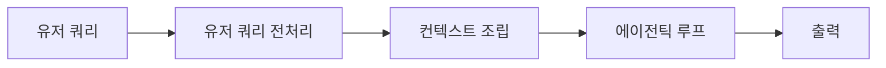
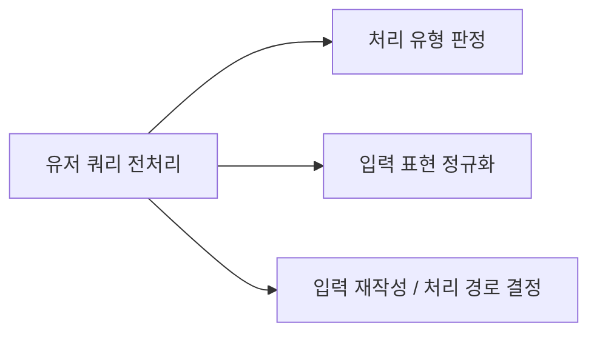
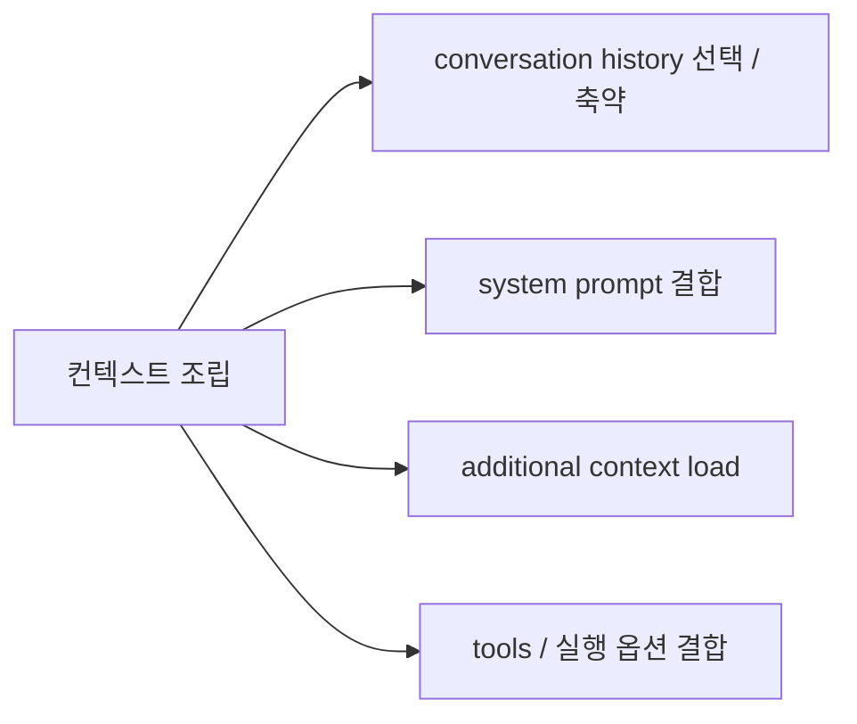
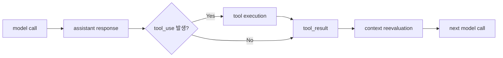
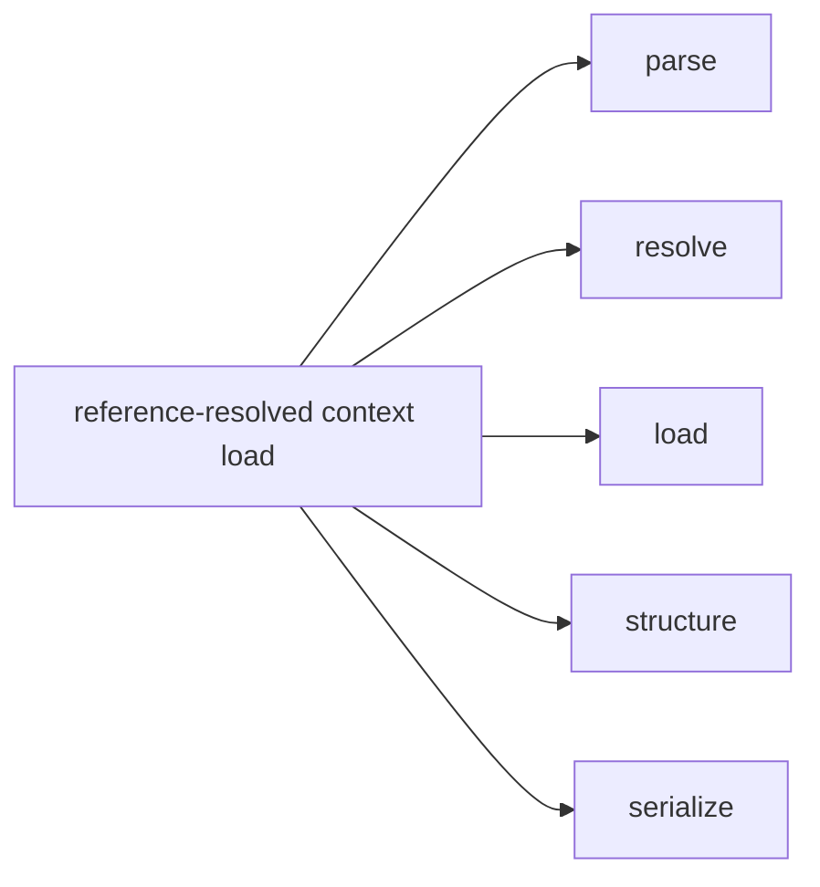
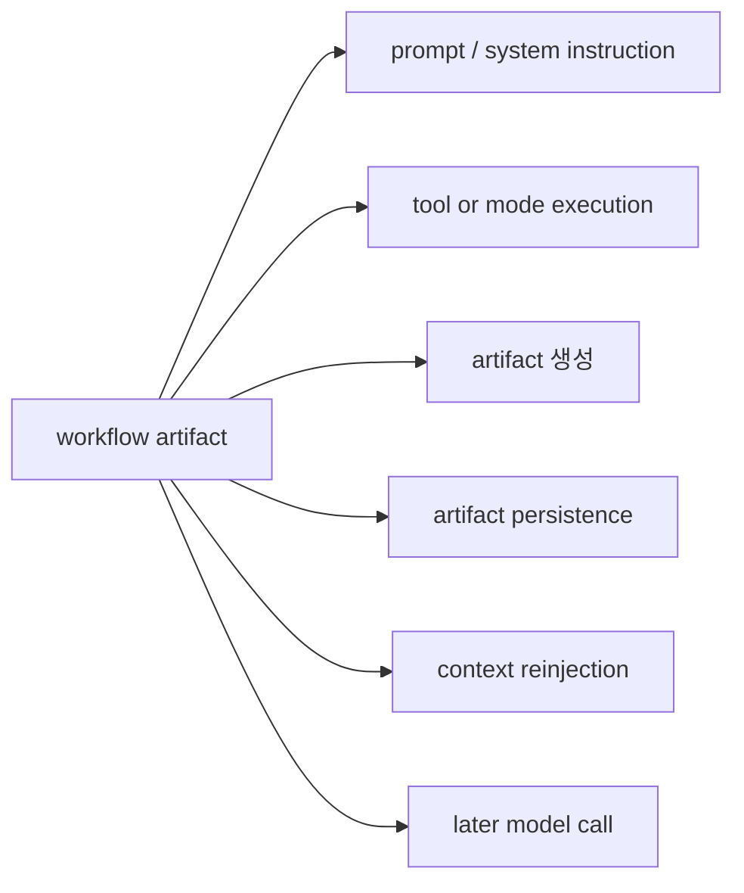
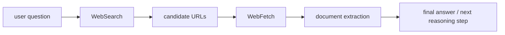
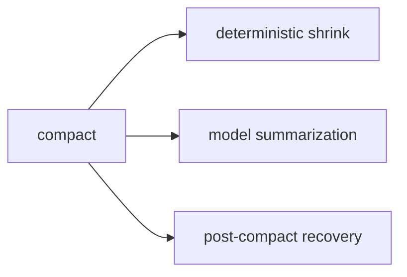

# E2E Analysis v2

이 문서는 현재 코드베이스를 기준으로 Claude Code 계열 런타임의 end-to-end 흐름을 설명하기 위한 **분석용 작업 문서**다.

중요한 점은 이 문서의 일부 용어와 다이어그램이 코드 안에 그대로 존재하는 공식 내부 taxonomy가 아니라, 소스코드 inspection을 바탕으로 정리한 **working model**이라는 점이다.  
즉 아래 구조는 구현을 설명하기 위한 해석 프레임이며, 이후 코드 변경에 따라 경계나 용어는 조정될 수 있다.

## Verification Basis

- 기준: 현재 저장소의 소스코드 inspection
- 범위: query loop, attachments/messages, tools, compact, workflow artifacts, memory/skill 관련 구현
- 비범위: 빌드 결과나 런타임 샘플 실행 자체를 사실 근거로 사용하지 않음

## Current Working E2E Model

현재 이 문서가 사용하는 상위 E2E 모델은 아래와 같다.



이 5단 구조는 코드에 동일한 이름으로 선언된 공식 단계라기보다, 현재 구현을 읽을 때 가장 설명력이 높은 상위 추상화다.

## Stage Definitions

### 1. 유저 쿼리

- 사용자가 입력창, 브리지, slash command, 기타 인터페이스를 통해 작업 입력을 제출하는 단계

### 2. 유저 쿼리 전처리

- 입력 형태를 분류하는 단계
- 입력을 공통 표현으로 정규화하는 단계
- 필요 시 rewrite 하거나 적절한 처리 경로로 라우팅하는 단계

### 3. 컨텍스트 조립

- system prompt / system context를 조립하는 단계
- conversation history를 선택하거나 줄이는 단계
- attachments, memory, queued state, tool/permission 상태를 현재 호출에 맞게 결합하는 단계

### 4. 에이전틱 루프

- 모델 호출
- 스트리밍 응답 처리
- `tool_use` 감지
- tool 실행
- `tool_result`와 상태 변화를 다음 reasoning step에 연결
- 필요 시 재호출

### 5. 출력

- 사용자에게 보이는 응답 surface
- transcript에 남는 surface
- 다음 모델 호출에 다시 들어가는 model-facing surface

이 셋은 종종 같은 내부 이벤트에서 파생되지만, 실제 payload와 필터링 규칙은 서로 다를 수 있다.

## Node Expansion

### 선택 노드: 유저 쿼리 전처리



#### 1. 처리 유형 판정

- 일반 프롬프트인지
- slash command인지
- bash 성격의 입력인지
- 브리지/remote 경로인지
- 어떤 경로로 처리할지를 정하는 단계

#### 2. 입력 표현 정규화

- 입력 문자열 정리
- pasted text 확장
- 이미지/블록 형태 정리
- 공통 submit shape로 맞추는 단계

#### 3. 입력 재작성 / 처리 경로 결정

- 특정 입력 패턴을 다른 경로로 rewrite
- slash / bash / prompt / remote 경로로 라우팅
- 일부 shortcut 또는 short-circuit를 결정

#### Notes

- 이 분해는 코드 설명을 위한 분석 프레임이다.
- attachment, memory, permission을 붙이는 단계는 여기보다 뒤의 `컨텍스트 조립`에서 다루는 편이 더 정확하다.

### 선택 노드: 컨텍스트 조립



#### 1. conversation history 선택 / 축약

- 세션 전체 messages 중 현재 호출에 실을 구간을 고른다.
- 필요 시 `compact`, `snip`, microcompact 같은 경로로 줄인다.

#### 2. system prompt 결합

- base system prompt
- custom / appended prompt
- system context

를 현재 호출의 최종 system instruction으로 결합한다.

#### 3. additional context load

- conversation history 바깥의 추가 context를 불러온다.
- 여기에는 attachment, queued state, memory surfacing, skill-related context 등이 포함될 수 있다.

#### 4. tools / 실행 옵션 결합

- tools
- permission context
- 모델/실행 옵션
- mode 관련 posture

를 현재 호출에 맞는 형태로 결합한다.

### Permission Context

`permission context`는 단순 allow/deny 목록보다 넓은 정책 레이어다.

현재 코드 기준으로 이 레이어는 대략 다음을 함께 다룬다.

- 어떤 tool이 모델 surface에 노출되는지
- 어떤 tool이 실제 실행 가능한지
- 현재 세션 posture가 어떤 mode인지
- mode 전이 시 어떤 permission rule을 유지/복원할지

즉 permission context는 “실행 허용 여부”만이 아니라 “현재 세션이 어떤 행동 posture로 동작하는가”까지 함께 조절한다.

### Agentic Loop

Claude Code의 query loop는 모델 호출과 tool 실행이 번갈아 이어지는 실행 루프다.



중요한 점은 turn 사이에 상태가 그대로 기계적으로 복사되는 것이 아니라, 매 step마다 다시 계산되고 필요한 것만 resurfacing된다는 점이다.

예를 들면:

- queued command
- reminder
- memory surfacing
- skill listing/discovery
- workflow reminders

등은 각각 dedup, relevance, feature/mode, usage cadence 조건을 거쳐 다시 들어간다.

### Steering In The Loop

현재 구현 기준으로 steering은 크게 두 축으로 이해할 수 있다.

1. system-side steering
- `<system-reminder>` 형태의 system-originated guidance
- session/state/tool 관련 reminder

2. user-side steering
- 진행 중 turn에 들어온 새 사용자 입력
- interrupt 또는 queued correction
- 이후 turn에 `queued_command` 성격으로 이어지는 경로

즉 작업 방향 수정은 별도의 독립 기능이라기보다, 같은 query loop 안에서 reinjection과 queue 처리로 통합된다.

### QueryEngine

`QueryEngine`는 headless / SDK 경로에서 conversation 단위 state와 turn lifecycle을 관리하는 상위 orchestration layer로 보는 것이 가장 적절하다.

핵심 역할은 대략 다음과 같다.

- `mutableMessages` 유지
- user input를 query loop 전에 transcript에 반영
- `query()` 호출에 필요한 context 준비
- message stream을 SDK-friendly 결과로 재패키징

다만 “QueryEngine이 모든 런타임 의미를 단독으로 소유한다”라고 보는 것은 과하다. 실제 의미 있는 동작은 `query.ts`, attachments/messages, compact/recovery 경로와 함께 분산되어 있다.

### 선택 노드: 출력

`출력`은 단순히 마지막 assistant text 하나를 보여주는 단계가 아니다.

실제로는 최소한 아래 surface를 구분해서 보는 편이 정확하다.

- user-facing output
- transcript-facing persistence
- model-facing normalized payload

예를 들면:

- UI에는 일부 메시지와 brief filtering이 적용될 수 있다.
- transcript는 resume-safe semantics를 위해 다른 형태로 남을 수 있다.
- 모델 입력은 `normalizeMessagesForAPI(...)`를 거치며 다시 필터링된다.

따라서 출력은 “최종 문자열 생성”보다, **내부 이벤트를 각 surface에 맞게 다시 구성하는 단계**라고 보는 편이 맞다.

## Reference-Resolved Context Load



사용자 입력 안의 짧은 참조 신호는 그대로 모델에 전달되지 않는다. 보통 다음 과정을 거친다.

- parse: 참조 신호를 파싱
- resolve: 실제 파일/resource/selection/agent 대상을 해석
- load: 필요한 내용을 읽음
- structure: typed attachment 또는 내부 context 구조로 변환
- serialize: 모델이 읽기 좋은 메시지 형태로 직렬화

즉 이 레이어는 “짧은 reference signal을 작업 가능한 모델 문맥으로 승격시키는 단계”라고 볼 수 있다.

## Memory / Skill Context Load

이 부분은 기존 문서보다 더 조심해서 분리해 쓰는 편이 정확하다.

### Memory 관련 메커니즘

- baseline instruction memory
- path-aware nested memory
- semantic relevant memories

메모리 쪽은 실제로 query/context와의 관련성, scope, dedup, budget을 함께 고려해 selective하게 surfaced되는 경향이 강하다.

### Skill 관련 메커니즘

- skill listing
- skill discovery
- dynamic skill awareness

다만 skill 쪽은 “현재 query에 맞는 것만 좁게 surfaced된다”라고 단정하면 과하다.  
현재 구현은 query-aware 선택도 있지만, broader listing/discovery/path-triggered awareness 경로도 함께 갖는다.

즉 memory와 skill은 둘 다 “여러 메커니즘의 조합”이라는 점은 맞지만, **selectivity의 강도와 방식은 동일하지 않다**.

## Memory Taxonomy

memory taxonomy는 현재 코드 기준으로 비교적 강하게 고정되어 있다.

- `user`
- `feedback`
- `project`
- `reference`

또한 메모리 파일은 대체로 frontmatter + body 구조를 따른다.

```markdown
---
name: {{memory name}}
description: {{one-line description}}
type: {{user | feedback | project | reference}}
---

{{memory content}}
```

중요한 점은 memory가 모든 것을 저장하는 범용 메모장이 아니라는 것이다.  
현재 프로젝트 상태만으로 쉽게 복원되는 코드 구조나 최근 작업 상태는 memory보다 plan/task/transcript가 더 적합하다.

## Memory Prompt Surfaces

메모리 시스템은 크게 두 경로로 이해할 수 있다.

1. 메인 에이전트가 직접 다루는 경로
- memory taxonomy와 저장 금지 규칙을 포함한 prompt surface

2. extraction subagent 경로
- 최근 대화에서 durable memory를 추출하는 경로
- taxonomy와 저장 규칙은 공유하지만 역할은 다름

즉 “같은 저장 규칙을 공유하지만 다른 책임을 가진 두 경로”라고 보는 것이 정확하다.

## Workflow Artifacts



Claude Code는 workflow 상태를 모델의 내부 기억에만 맡기지 않고, 외부 artifact로 남긴 뒤 다시 resurfacing한다.

### Plan

- plan mode 아래에서 생성되는 문서형 artifact
- 일반적으로 markdown file
- 이후 plan reference 또는 restored context로 다시 쓰인다

### Todo (V1)

- `TodoWrite` 기반의 세션 checklist artifact
- file-backed보다는 AppState + transcript 성격이 강함
- 필요 시 `todo_reminder`로 resurfacing

### Task (V2)

- `TaskCreate` / `TaskUpdate` / `TaskList` / `TaskGet` 중심
- JSON task file 기반 state
- `task_reminder`, `task_status`, 직접 조회를 통해 resurfacing

### Context Reinjection

plan / todo / task는 매 turn 통째로 들고 다니는 구조가 아니라, 필요 시 다시 읽거나 reminder/status 형태로 resurfacing되는 구조에 가깝다.

## Tool System Insights

이 섹션의 용어는 구현에 대한 **설명용 분류**로 받아들이는 것이 좋다.  
코드가 “tool surface 4종” 같은 taxonomy를 공식적으로 선언하는 것은 아니다.

그럼에도 현재 구현을 읽을 때 다음 구분은 설명력이 있다.

### 1. Model surface

- tool prompt
- input schema
- `tool_result` serialization
- attachment reinjection

### 2. Runtime surface

- 실제 환경/상태 변경
- file edit, shell execution, mode change, task state update 등

### 3. UX surface

- 사용자에게 보이는 메시지
- condensed transcript
- tool UI

즉 tool은 단순 function call보다 넓은 개념으로 작동하지만, 이 분류 자체는 **분석 vocabulary**이지 코드의 1급 enum은 아니다.

## BriefTool Example

`BriefTool`은 이 설명 프레임이 왜 유용한지 보여주는 사례다.

- 핵심 효과가 world-state mutation보다 user-facing communication에 가깝다
- brief mode activation과 실제 message-send tool call은 분리되어 있다

즉 tool은 “외부 세상을 읽거나 바꾸는 primitive”일 뿐 아니라, 대화 채널과 세션 UX를 설계하는 런타임 장치이기도 하다.

## Web Reasoning Pipeline

웹 접근은 대체로 다음처럼 이해할 수 있다.



### WebSearch

- breadth 단계
- 관련 source와 URL 후보를 찾는 역할
- raw search event를 그대로 넘기기보다 normalized result로 재구성

### WebFetch

- depth 단계
- URL safety, domain policy, redirect handling, quote/copyright guardrail
- HTML -> markdown 정규화
- 필요 시 secondary extraction

즉 `WebSearch`와 `WebFetch`의 역할 분리는 현재 코드와 잘 맞는다.

## Compact



핵심은 “압축 = 곧바로 모델 요약”이 아니라는 점이다.

현재 구현은 먼저 가능한 deterministic shrink를 시도한다.

- persisted-output wrapper
- old tool result clearing
- truncation / preview
- microcompact / time-based compact

이런 경로로 충분하지 않을 때만 model summarization이 뒤따른다.

## Compact 이후 Context 복원

compact 뒤에는 summary만 남는 것이 아니라, 이후 실행에 필요한 맥락이 다시 복원된다.

대략 다음 범주가 중요하다.

- 작업 대상 context
- session continuity context
- instruction / guidance context
- capability / environment context
- async / external work context

이 역시 코드의 공식 enum은 아니지만, 현재 복원 로직을 읽을 때 설명력이 높은 분해다.

## Appendix: Built-in Tool Registry

`getAllBaseTools()` 기준의 built-in registry와 실제 세션에서 노출되는 effective tool surface는 다를 수 있다.

실제 세션에서는 보통 다음 요소가 추가로 작동한다.

- feature gating
- env/platform gating
- interactive / coordinator mode filtering
- permission deny rules
- `isEnabled()` 체크
- MCP merge / dedup

즉 appendix의 tool list는 **registry-level inventory**로 읽는 것이 맞고, 곧바로 “현재 세션에서 모델이 다 쓸 수 있는 tool set”으로 읽으면 과하다.
