# E2E Analysis

이 문서는 코드베이스의 end-to-end 흐름을 점진적으로 분석하기 위한 작업 문서다.
처음에는 높은 수준의 추상화만 기록하고, 이후 단계별로 세부 분석을 계속 추가한다.

## Current E2E Abstraction

현재 합의한 E2E 추상화는 아래와 같다.

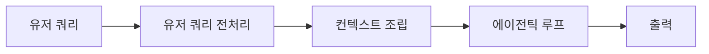

이 문서는 위 E2E 그래프를 기준으로 각 노드를 별도 섹션에서 확장해 나간다.

## Stage Definitions

### 1. 유저 쿼리

- 사용자가 입력창 또는 인터페이스를 통해 질의를 제출하는 단계

### 2. 유저 쿼리 전처리

- 사용자 입력 자체를 해석하는 단계
- 입력 형태를 판별하는 단계
- 입력을 정규화하는 단계
- 필요 시 입력을 rewrite 하거나 적절한 처리 경로로 라우팅하는 단계

### 3. 컨텍스트 조립

- 시스템 프롬프트 결합
- 대화 히스토리 반영
- attachment, memory, tool, permission 상태 결합
- 모델 호출에 필요한 실행 컨텍스트 구성

### 4. 에이전틱 루프

- 모델 호출
- 스트리밍 응답 처리
- tool_use 감지
- 툴 실행
- tool_result 반영
- 필요 시 모델 재호출

### 5. 출력

- 사용자에게 assistant 응답이 스트리밍되거나 완료 상태로 반영되는 단계

## Node Expansion

이 섹션에서는 E2E 그래프의 각 노드를 1-depth씩 확장한다.
현재는 `유저 쿼리 전처리`와 `컨텍스트 조립`을 확장했다.

### 선택 노드: 유저 쿼리 전처리

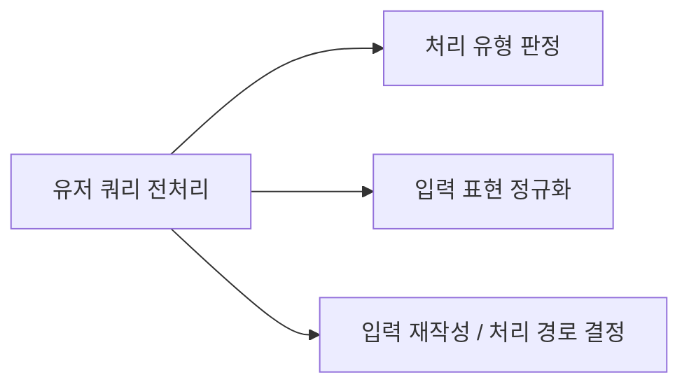

#### 하위 노드 정의

##### 1. 처리 유형 판정

- 일반 프롬프트인지
- slash command인지
- bash mode인지
- remote input인지
- 어떤 처리 경로로 보낼지 가르는 단계

##### 2. 입력 표현 정규화

- 입력 문자열 정리
- pasted text expansion
- 이미지/블록 형태 정리
- 사용자 입력 자체를 공통 형태로 맞추는 단계

##### 3. 입력 재작성 / 처리 경로 결정

- 특정 입력 패턴을 다른 경로로 rewrite 하는 단계
- slash, bash, remote 등 적절한 처리 경로로 라우팅하는 단계
- 로컬 short-circuit가 발생할 수 있는 단계

#### Notes

- 이 분해는 `유저 쿼리 전처리`를 설명하기 위한 1-depth 추상화다.
- 범위는 사용자 입력 자체의 해석/정규화/라우팅까지만 한정한다.
- attachment, history, memory, tool, permission을 붙이는 일은 `컨텍스트 조립`에서 다룬다.

### 선택 노드: 컨텍스트 조립

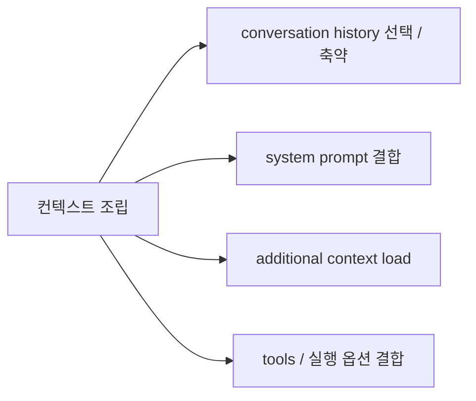

#### 하위 노드 정의

##### 1. conversation history 선택 / 축약

- 세션 전체 messages 중 이번 호출에 반영할 history 구간을 고르는 단계
- 필요 시 history를 compact, snip, 기타 축약 경로로 줄이는 단계

##### 2. system prompt 결합

- system prompt와 system context를 최종 system instruction으로 결합하는 단계

##### 3. additional context load

- conversation history 바깥의 추가 context를 현재 호출에 로드하는 단계
- memory, attachment, queued state, skill 관련 context 등이 여기에 포함될 수 있다

##### 4. tools / 실행 옵션 결합

- tools, permission, model, thinking 설정 등 실행 옵션을 현재 호출에 결합하는 단계

##### Permission Context

`permission context`는 Claude Code의 tool 사용과 실행 경계를 제어하는 정책 레이어다.  
이 레이어는 단순한 allow/deny 목록이 아니라, 현재 mode, rule set, 추가 작업 디렉터리, permission prompt 동작, auto/plan mode 전이까지 함께 관리한다.

핵심은 이 로직이 상당히 복잡하지만 동시에 유연하다는 점이다. Claude Code는 이 permission context를 통해:

- 어떤 tool을 모델에게 노출할지
- 어떤 tool을 실제로 실행 가능하게 할지
- 현재 세션이 `default`, `plan`, `auto`, `bypassPermissions` 중 어떤 posture로 동작할지
- mode 전이 시 어떤 rule을 유지하거나 제거하거나 복원할지

를 결정한다.

이 문서에서는 permission context의 내부 전이 로직을 자세히 풀어 설명하지는 않는다. 다만 Claude Code 내부에는 비교적 정교한 permission/business logic이 존재하며, 이후 구현을 수정하거나 behavior를 정확히 이해해야 할 때는 관련 소스코드를 직접 분석해 reference로 삼는 것이 유용하다.

##### Agentic Loop

Claude Code의 agentic loop는 모델 호출, tool execution, 그리고 context reinjection을 반복하는 실행 루프다. 각 turn에서 Claude Code는 assistant 응답과 tool 결과를 정리한 뒤, 그 시점의 세션 상태를 다시 평가해 attachment, reminder, memory, queued message를 필요에 따라 추가로 주입하고, 이들을 다음 모델 호출의 입력으로 사용한다.

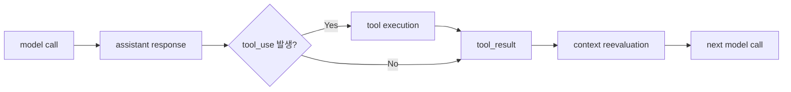

중요한 점은 Claude Code가 long-running task에서 관련 상태를 매 turn 무조건 다시 넣는 것이 아니라, 현재 시점에 필요한 상태만 다시 계산해 주입한다는 점이다. 예를 들어 reminder는 tool 사용 여부와 turn 수, mode state, verification 상태를 기준으로 조건부 주입되고, memory와 skill은 relevance와 dedup 조건을 통과할 때만 surfaced되며, queued message는 진행 중 turn에 들어온 새 사용자 입력이나 notification을 다음 reasoning step에 연결하는 경로로 사용된다.

이 구조 덕분에 Claude Code는 장기 작업에서도 상태를 잊지 않고, 직전 실행 결과와 운영 맥락을 반영한 채 다음 reasoning step으로 이어갈 수 있다.

##### Steering in the Loop

Claude Code에는 사실상 steering message에 해당하는 메커니즘이 존재한다. 하나는 system-side steering으로, `systemPrompt + systemContext` 및 `<system-reminder>` 기반 meta message가 모델의 posture와 주의사항을 계속 보정한다. 다른 하나는 user-side steering으로, 진행 중 turn에 사용자가 새 prompt를 입력하면 이 입력은 queue에 들어가고, 경우에 따라 현재 turn을 interrupt하거나, 그렇지 않으면 `queued_command` attachment로 다음 모델 호출의 입력에 주입된다.

즉 Claude Code는 system-side reminder와 user-side mid-flight correction을 모두 같은 agentic loop 안에 통합해, 현재 작업 방향을 지속적으로 조정할 수 있게 만든다.

##### QueryEngine

`QueryEngine`는 Claude Code의 headless / SDK 경로에서 conversation state와 query lifecycle을 소유하는 실행 엔진이다. 하나의 `QueryEngine` 인스턴스는 하나의 conversation에 대응하며, 각 `submitMessage()` 호출은 같은 state 위에서 새로운 turn을 실행한다.

중요한 점은 `QueryEngine`가 단순히 `query()`를 호출하는 얇은 wrapper가 아니라는 점이다. 이 엔진은 입력 전처리, system/context 준비, query loop 실행, transcript persistence, SDK result packaging을 하나의 흐름으로 묶는다. 따라서 `query()`가 실제 agentic loop라면, `QueryEngine`는 그 loop를 conversation 단위로 관리하는 상위 orchestration layer라고 볼 수 있다.

이 구조에서 `QueryEngine`의 tricky한 부분은 새로운 reasoning 알고리즘에 있지 않다. 오히려 다음과 같은 runtime engineering에 있다.

- `mutableMessages`를 conversation state로 직접 유지한다.
- user message를 query loop 진입 전에 transcript에 기록해, 응답 전에 프로세스가 종료되어도 resume 가능한 상태를 남긴다.
- assistant / progress / attachment / system message를 서로 다른 persistence semantics로 다룬다.
- interruption을 단순 abort가 아니라, 이후 turn continuation이 가능한 conversation state로 복구 가능한 형태로 다룬다.
- REPL과 달리 headless/SDK consumer가 이해할 수 있는 결과 형태로 message stream을 다시 패키징한다.

즉 `QueryEngine`는 Claude Code의 query loop를 headless 환경에서 반복 가능하고 resume-safe하게 유지하기 위한 stateful conversation runtime이라고 이해하는 것이 가장 적절하다.

### 선택 노드: 출력

`출력`은 단순히 마지막 assistant text를 보여주는 단계가 아니다. Claude Code는 하나의 turn 결과를 사용자-facing surface, transcript surface, model-facing surface로 다르게 다룬다. 즉 같은 내부 이벤트라도:

- 사용자에게 보이는 방식
- transcript에 남는 방식
- 다음 모델 호출에 다시 들어가는 방식

이 서로 다를 수 있다.

핵심은 다음과 같다.

- assistant streaming 응답은 partial/final 상태로 사용자에게 순차적으로 보일 수 있다.
- tool 실행 결과는 tool result, attachment, progress, notification 등 다른 surface로 표현될 수 있다.
- `normalizeMessagesForAPI(...)`는 이 중 모델이 다시 읽을 필요가 없는 것(progress, 일부 system message, synthetic error, virtual message 등)을 제거하고, 필요한 것만 model-facing payload로 정리한다.
- brief mode 같은 특수 모드에서는 사용자가 보는 transcript 자체가 다시 필터링된다. 즉 사용자-facing output과 model-facing payload가 명시적으로 분리된다.
- headless / SDK 경로에서는 `QueryEngine`가 이 결과를 다시 `SDKMessage`와 최종 `result` 객체로 패키징한다.

따라서 Claude Code의 `출력`은 단일 응답 문자열이 아니라, 내부 실행 결과를 목적에 따라 서로 다른 표면으로 재구성하는 단계라고 볼 수 있다.

#### Notes

- 이 분해는 `컨텍스트 조립`을 설명하기 위한 1-depth 추상화다.
- 핵심은 이번 호출에 실릴 context window를 구성하는 것이다.
- `conversation history`는 세션 전체 기록이고, `context window`는 이번 호출에 실제로 실리는 부분이다.

#### 선택 노드: reference-resolved context load

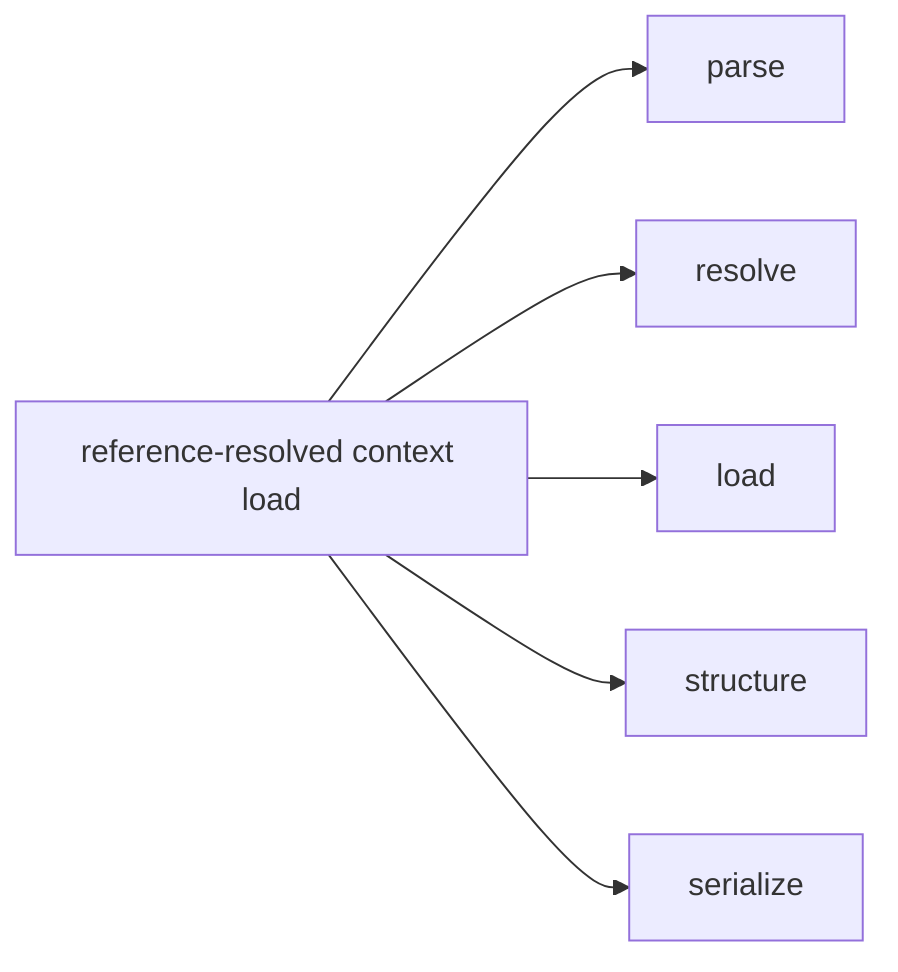

사용자의 입력 안에는 짧은 참조 신호가 들어올 수 있다. 예를 들면 파일 참조, MCP resource 참조, agent 참조, IDE selection 같은 것들이다. Claude Code는 이 신호를 그대로 모델에 보내지 않고, 실제 작업에 도움이 되는 context로 변환한다.

핵심은 다음과 같다.

- 사용자의 참조 신호를 파싱한다.
- 그 신호가 실제로 무엇을 가리키는지 해석한다.
- 필요한 내용을 읽거나 불러온다.
- 그 결과를 내부 attachment 구조로 만든다.
- 마지막으로 모델이 잘 이해할 수 있는 형태로 직렬화한다.

이 과정은 단순 문자열 치환이 아니다. 파일, 디렉터리, 큰 PDF, 이미 읽은 파일, MCP resource, agent mention은 각각 다른 방식으로 처리된다. 또한 중복 전송을 피하고, 큰 컨텍스트가 불필요하게 늘어나지 않도록 최적화가 적용된다.

중요한 점은 최종 표현 방식이다. Claude Code는 추가 context를 단순 텍스트로 붙이기보다, 모델이 더 잘 이해할 수 있는 메시지 형식으로 재구성한다. 경우에 따라서는 도구 호출 결과처럼 보이도록 표현되며, reminder나 system-style context처럼 직렬화되기도 한다.

요약하면, 이 레이어는 사용자의 짧은 참조 신호를 실제 작업 가능한 모델 문맥으로 승격시키는 역할을 한다.

#### 선택 노드: memory / skill context load

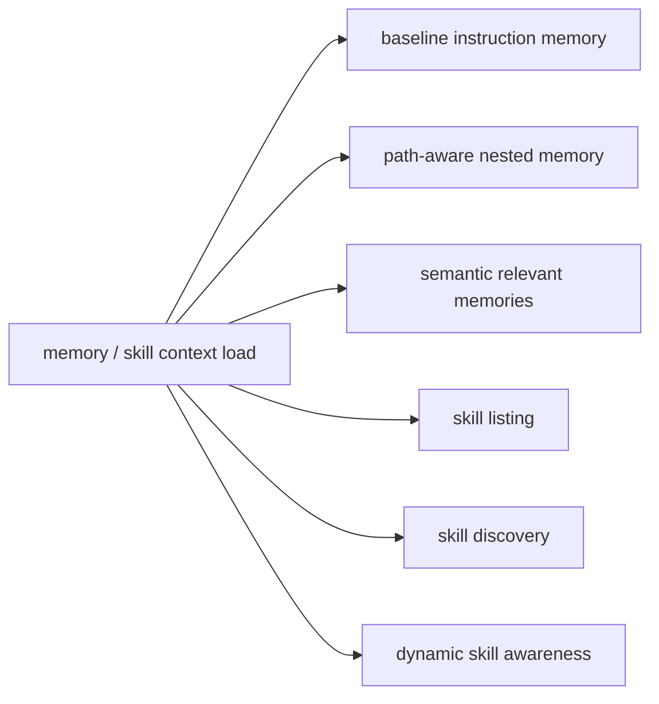

이 레이어는 현재 요청을 더 잘 처리하기 위해, 적용해야 할 규칙과 떠올려야 할 기억, 활용 가능한 능력을 현재 query에 맞춰 선택적으로 로드하는 단계다.

핵심은 memory와 skill이 각각 한 가지가 아니라 여러 메커니즘의 조합이라는 점이다.

- baseline instruction memory는 세션 전체에 지속적으로 적용되는 instruction memory다. 대표적으로 CLAUDE.md 계열이 여기에 속한다.
- path-aware nested memory는 특정 파일이나 경로를 다룰 때만 활성화되는 instruction이다. 여기에는 디렉터리별 CLAUDE.md, `.claude/CLAUDE.md`, `.claude/rules/*.md`, 그리고 경로 조건이 달린 규칙 파일이 포함될 수 있다.
- semantic relevant memories는 현재 user query와 최근 사용 도구를 기준으로 관련 memory를 고르는 query-aware recall 레이어다.
- skill listing은 현재 사용 가능한 skill 집합을 노출하는 capability catalog다.
- skill discovery는 현재 요청에 relevant한 skill subset을 추가로 발견해 드러내는 레이어다.
- dynamic skill awareness는 세션 중에 새로 드러난 skill 디렉터리나 capability 변화를 감지하는 레이어다.

중요한 점은 이 모든 context가 무조건 많이 로드되는 것이 아니라는 점이다. Claude Code는 scope, relevance, dedup, budget을 함께 고려해 어떤 memory와 skill을 현재 요청에 실을지 조절한다. 따라서 이 레이어의 역할은 단순한 정보 주입이 아니라, 현재 요청에 맞는 규칙, 기억, 능력을 선별적으로 활성화하는 것이다.

특히 `.claude/rules/*.md`는 CLAUDE.md를 더 잘게 쪼개고, 필요하면 특정 경로에만 조건부로 적용할 수 있게 만든 instruction 파일 시스템으로 이해하면 된다. 계층형 CLAUDE.md가 디렉터리 단위의 큰 instruction hierarchy라면, rules 파일은 더 작은 단위의 규칙 모듈이며, 경로 조건에 따라 선택적으로 활성화될 수 있다.

##### Memory taxonomy

Claude Code의 memory는 자유 형식이 아니라 미리 정의된 taxonomy 위에서 저장된다. 핵심 유형은 다음 네 가지다.

- `user`
  사용자 역할, 선호, 지식 수준, 협업 방식에 대한 기억이다.
  예: "Go는 익숙하지만 React는 처음이다", "간결한 답변을 선호한다"
- `feedback`
  Claude의 작업 방식에 대한 사용자 피드백이다.
  예: "끝에 요약을 붙이지 마", "테스트에서 mock DB를 쓰지 마"
- `project`
  코드와 git 상태만으로는 복원하기 어려운 프로젝트 맥락이다.
  예: "이번 주 목요일 이후 merge freeze", "이 변경은 compliance 이슈 때문에 진행 중"
- `reference`
  외부 시스템이나 리소스의 위치를 가리키는 포인터다.
  예: "이 이슈는 Linear의 INGEST 프로젝트에서 본다", "이 Grafana 대시보드를 본다"

이 taxonomy는 메인 에이전트와 background extraction subagent가 공통으로 사용한다. 즉 어떤 memory를 저장할지 판단할 때도, 이후 memory를 읽어 활용할 때도 같은 분류 체계를 공유한다.

##### Taxonomy original examples

원문 taxonomy에는 각 type마다 representative example이 직접 들어 있다. 예를 들면 다음과 같다.

```text
user
- "I'm a data scientist investigating what logging we have in place"
- "I've been writing Go for ten years but this is my first time touching the React side of this repo"

feedback
- "don't mock the database in these tests — we got burned last quarter when mocked tests passed but the prod migration failed"
- "stop summarizing what you just did at the end of every response, I can read the diff"

project
- "we're freezing all non-critical merges after Thursday — mobile team is cutting a release branch"
- "the reason we're ripping out the old auth middleware is that legal flagged it for storing session tokens in a way that doesn't meet the new compliance requirements"

reference
- "check the Linear project \"INGEST\" if you want context on these tickets"
- "the Grafana board at grafana.internal/d/api-latency is what oncall watches"
```

##### Memory file format

메모리 파일은 frontmatter + 본문 구조를 갖는다.

```markdown
---
name: {{memory name}}
description: {{one-line description}}
type: {{user | feedback | project | reference}}
---

{{memory content}}
```

중요한 점은 `description`이 단순 제목이 아니라, 이후 relevance selection에서 어떤 memory가 현재 query에 유용한지 판단하는 데 쓰인다는 점이다.

##### Hardcoded memory rules

메모리 프롬프트에는 무엇을 저장해야 하고 무엇을 저장하지 말아야 하는지가 하드코딩되어 있다.

저장해야 하는 것:

- 사용자가 명시적으로 기억해 달라고 요청한 정보
- 사용자 선호, 역할, 지식 수준, 협업 방식
- 반복된 교정과 작업 방식 피드백
- 프로젝트의 배경, 의사결정 이유, 일정, incident 맥락
- 외부 시스템에 대한 포인터

저장하지 말아야 하는 것:

- 코드 패턴, 아키텍처, 파일 구조처럼 현재 프로젝트 상태에서 다시 유도 가능한 정보
- git history나 최근 변경 내역
- 디버깅 해결법 자체
- 이미 CLAUDE.md 계열 instruction에 있는 것
- 현재 대화 안에서만 유효한 임시 상태
- task나 plan으로 관리해야 할 현재 작업 상태

즉 memory는 "무엇이든 저장하는 메모장"이 아니라, 미래 대화에서도 유용하지만 현재 프로젝트 상태만으로는 쉽게 복원되지 않는 정보를 위한 장기 persistence 계층이다.

##### Memory prompt surfaces

메모리 시스템과 관련된 하드코딩된 프롬프트는 크게 두 군데 있다.

1. 메인 에이전트용 memory prompt

메인 에이전트의 시스템 프롬프트에는 memory taxonomy, 저장 규칙, 저장하지 말아야 할 것, memory와 plan/task의 차이가 포함된다. 따라서 메인 에이전트는 작업 중에도 직접 memory를 write/edit할 수 있다.

2. background extraction subagent prompt

턴 종료 후에는 별도의 extraction subagent가 최근 대화를 검토해 durable memory를 자동 추출할 수 있다. 이 subagent도 동일한 taxonomy와 저장 규칙을 사용하며, 기존 memory 목록을 먼저 보고 중복을 피하면서 필요한 memory만 저장하도록 설계돼 있다.

즉 Claude Code의 memory 시스템은 "메인 에이전트가 필요 시 직접 저장"하는 경로와 "턴 종료 후 extraction subagent가 자동으로 정리 저장"하는 경로를 함께 가진다.

##### Hardcoded prompt summary

메인 에이전트용 memory prompt에는 대략 다음 규칙이 직접 들어 있다.

- 지속적인 file-based memory system이 존재한다는 설명
- 사용자가 명시적으로 기억해 달라고 하면 즉시 저장하라는 지시
- memory taxonomy (`user`, `feedback`, `project`, `reference`) 설명
- 무엇을 저장하지 말아야 하는지에 대한 금지 규칙
- memory는 plan/task와 다르며, 현재 대화에만 유효한 상태를 저장하는 용도가 아니라는 설명
- memory를 어떻게 저장하고, `MEMORY.md`를 어떻게 index로 유지해야 하는지에 대한 지시

background extraction subagent prompt에는 대략 다음 규칙이 직접 들어 있다.

- 최근 새 대화 구간만 보고 persistent memory를 업데이트하라는 지시
- 기존 memory manifest를 먼저 확인하고 중복 파일을 만들지 말라는 지시
- memory directory 밖에는 쓰지 말라는 도구 제약
- 제한된 turn budget 안에서 효율적으로 read 후 write를 수행하라는 지시
- 사용자가 명시적으로 기억하라고 한 내용은 강한 저장 신호라는 규칙
- taxonomy, 저장 금지 규칙, memory file format을 메인 에이전트와 동일하게 공유한다는 점

즉 메인 에이전트와 extraction subagent는 서로 다른 역할을 갖지만, 어떤 memory를 저장해야 하는지에 대해서는 동일한 하드코딩된 규칙 체계를 공유한다.

##### Prompt originals (excerpt)

메인 에이전트용 memory prompt 원문에는 다음과 같은 지시가 직접 포함된다.

```text
You have a persistent, file-based memory system at `<memoryDir>`.

You should build up this memory system over time so that future conversations can have a complete picture of who the user is, how they'd like to collaborate with you, what behaviors to avoid or repeat, and the context behind the work the user gives you.

If the user explicitly asks you to remember something, save it immediately as whichever type fits best. If they ask you to forget something, find and remove the relevant entry.

Memory is one of several persistence mechanisms available to you as you assist the user in a given conversation.
- When to use or update a plan instead of memory ...
- When to use or update tasks instead of memory ...
```

background extraction subagent prompt 원문에는 다음과 같은 지시가 직접 포함된다.

```text
You are now acting as the memory extraction subagent. Analyze the most recent ~N messages above and use them to update your persistent memory systems.

Check this list before writing — update an existing file rather than creating a duplicate.

You MUST only use content from the last ~N messages to update your persistent memories.
Do not waste any turns attempting to investigate or verify that content further.

If the user explicitly asks you to remember something, save it immediately as whichever type fits best. If they ask you to forget something, find and remove the relevant entry.
```

즉 두 프롬프트 모두 memory taxonomy와 저장 규칙을 공유하지만, 메인 에이전트는 작업 도중 즉시 저장을 할 수 있고, extraction subagent는 최근 대화를 정리해 durable memory를 자동 추출하는 역할에 더 초점이 맞춰져 있다.

##### Representative memory examples

taxonomy별 memory는 대략 다음과 같은 내용으로 저장되는 것이 의도되어 있다.

- `user`
  사용자 역할, 전문성, 협업 선호를 담는다.
  예: "사용자는 Go에는 익숙하지만 React는 처음이므로, 프론트엔드 설명은 백엔드 개념에 비유해서 설명한다."

- `feedback`
  Claude의 작업 방식에 대한 반복 가능한 피드백을 담는다.
  예: "이 사용자는 응답 끝에 요약을 붙이지 않는 것을 선호한다."
  예: "이 프로젝트의 테스트는 mock DB가 아니라 실제 DB를 사용해야 한다."

- `project`
  코드와 git 상태만으로는 복원하기 어려운 프로젝트 배경과 맥락을 담는다.
  예: "이번 auth middleware 교체는 기술 부채 정리가 아니라 compliance 요구사항 대응이 우선 이유다."
  예: "목요일 이후 merge freeze가 시작되므로 비핵심 변경은 그 전에 정리해야 한다."

- `reference`
  외부 시스템이나 문서 위치를 가리키는 포인터를 담는다.
  예: "pipeline 관련 이슈는 Linear의 INGEST 프로젝트에서 확인한다."
  예: "request path 변경 시 oncall이 보는 Grafana latency 대시보드를 확인한다."

이 예시들은 memory가 단순 요약문이 아니라, 미래의 요청 처리에 직접 도움이 되는 장기적 작업 문맥을 저장하기 위한 것임을 보여준다.

#### 선택 노드: workflow artifacts

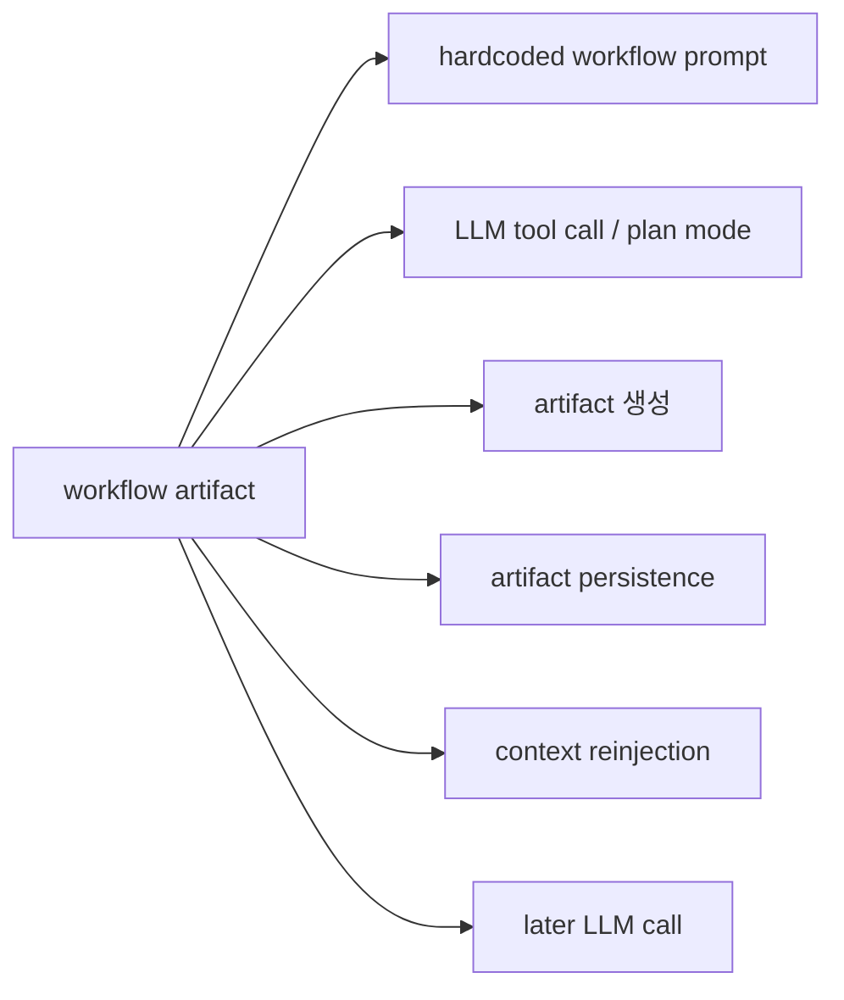

Claude Code는 `plan`, `todo`, `task`를 단순 UI 상태가 아니라 workflow artifact로 취급한다. 이 artifact들은 모두 하드코딩된 prompt 또는 system instruction 아래에서 모델이 생성하며, 생성된 이후에도 필요할 때 다시 context에 주입되어 이후 호출의 품질과 일관성을 높인다.

핵심은 workflow 상태를 모델의 내부 기억에만 맡기지 않는다는 점이다. Claude Code는 planning, progress tracking, task coordination을 모두 외부 artifact로 남기고, 이후 turn에서 다시 불러와 reasoning의 기준점으로 사용한다.

##### Plan

`plan`은 별도 planner 서비스가 만드는 결과물이 아니라, 메인 모델이 plan mode에 들어간 뒤 직접 작성하는 문서형 artifact다.

- 모델은 하드코딩된 plan mode system instruction을 받는다.
- 이 instruction은 "지금은 실행이 아니라 설계 단계"임을 강하게 규정한다.
- 모델은 read-only 탐색, 질문, 필요 시 subagent 호출을 거친 뒤 `FileWrite` 또는 `FileEdit`로 plan file을 작성한다.
- 마지막에는 `ExitPlanMode`를 호출해 사용자 승인 단계로 넘긴다.

`plan`의 산출물은 markdown plan file이다.

- 기본 경로: `~/.claude/plans/<slug>.md`
- subagent 경로: `~/.claude/plans/<slug>-agent-<agentId>.md`

포맷은 자유 markdown이지만, 실제로는 하드코딩된 작성 규칙이 준-스키마 역할을 한다. 예를 들어 plan file에는 보통 `Context`, 변경할 파일 경로, 재사용할 함수/유틸, `Verification` 같은 요소가 포함되도록 강하게 유도된다.

즉 `plan`은 문서 기반 workflow artifact다.

##### Todo (V1)

V1의 `todo`는 `TodoWrite` tool을 통해 생성되는 세션 체크리스트형 artifact다.

- `TodoWrite`는 하드코딩된 tool prompt를 가진다.
- 이 prompt는 언제 todo list를 써야 하는지, 언제 쓰지 말아야 하는지, 어떤 상태를 유지해야 하는지, 한 번에 하나만 `in_progress`로 유지해야 한다는 점까지 직접 규정한다.

`TodoWrite`의 산출물은 markdown 문서가 아니라 구조화된 payload다.

```ts
{
  todos: Array<{
    content: string
    status: 'pending' | 'in_progress' | 'completed'
    activeForm: string
  }>
}
```

이 payload는 file-backed artifact가 아니라 AppState와 transcript에 남는다. 따라서 V1 todo는 생성 후에도 대화 히스토리에서 다시 보일 수 있고, resume 시 transcript를 다시 읽어 복원될 수 있으며, 필요하면 `todo_reminder` attachment를 통해 현재 목록이 다시 모델 입력에 주입된다.

즉 `todo`는 세션 상태 + transcript 기반 workflow artifact다.

##### Task (V2)

V2에서는 `TodoWrite` 대신 `TaskCreate`, `TaskUpdate`, `TaskList`, `TaskGet` 중심의 task 시스템이 사용된다.

- 이 도구들도 모두 하드코딩된 prompt를 가진다.
- 이 prompt들은 언제 task를 만들어야 하는지, 언제 trivial해서 만들지 말아야 하는지, `subject`, `description`, `activeForm`, `status`, `owner`, `dependencies`를 어떻게 관리해야 하는지까지 규정한다.

`task`의 산출물은 JSON task file이다.

- 기본 경로: `~/.claude/tasks/<taskListId>/<id>.json`

대략 이런 구조를 가진다.

```ts
{
  id: string
  subject: string
  description: string
  activeForm?: string
  owner?: string
  status: 'pending' | 'in_progress' | 'completed'
  blocks: string[]
  blockedBy: string[]
  metadata?: Record<string, unknown>
}
```

즉 V2 task는 file-backed structured workflow state다.

##### Context Reinjection

이 artifact들은 생성되고 끝나는 것이 아니라, 이후 turn에서 다시 context에 반영된다.

`plan`은 planning 및 implementation 흐름에서 다시 참조될 수 있는 기준 문서로 남는다. 필요할 때 다시 읽히거나, compact 이후 plan 관련 attachment로 resurfacing되어 이후 reasoning의 기준점이 된다.

`todo`는 transcript와 AppState를 통해 유지되며, resume 시 복원될 수 있다. 또한 `TodoWrite`를 한동안 사용하지 않으면 `todo_reminder` attachment가 현재 todo list를 다시 모델 입력에 주입한다.

`task`는 항상 자동으로 전체가 주입되지는 않는다. 대신 세 가지 방식으로 다시 surfaced된다.

1. 모델이 필요할 때 `TaskList` 또는 `TaskGet`을 직접 호출해 읽는다.
2. task tool을 오래 사용하지 않으면 `task_reminder`가 현재 task list를 reminder 형태로 다시 주입한다.
3. background task나 local task의 상태가 변하면 `task_status` 또는 notification 형태로 현재 reasoning에 필요한 변화만 다시 전달된다.

즉 Claude Code는 workflow state를 항상 통째로 들고 다니지 않는다. 대신 필요할 때 읽고, 잊을 때 reminder를 붙이고, 상태가 바뀌면 notification으로 알려주는 방식으로 artifact를 재주입한다.

##### Hardcoded prompt excerpts

아래 excerpt는 workflow artifact를 생성하도록 모델을 유도하는 하드코딩된 prompt의 성격을 보여준다.

**Plan mode system instruction**

```text
Plan mode is active. The user indicated that they do not want you to execute yet -- you MUST NOT make any edits (with the exception of the plan file mentioned below), run any non-readonly tools (including changing configs or making commits), or otherwise make any changes to the system.

## Plan File Info:
... You should build your plan incrementally by writing to or editing this file.

### Phase 4: Final Plan
Goal: Write your final plan to the plan file (the only file you can edit).
- Begin with a Context section ...
- Include the paths of critical files to be modified
- Reference existing functions and utilities ...
- Include a verification section ...
```

**ExitPlanMode prompt**

```text
Use this tool when you are in plan mode and have finished writing your plan to the plan file and are ready for user approval.

- You should have already written your plan to the plan file specified in the plan mode system message
- This tool does NOT take the plan content as a parameter - it will read the plan from the file you wrote
- The user will see the contents of your plan file when they review it
```

**TodoWrite prompt**

```text
Use this tool to create and manage a structured task list for your current coding session.

## When to Use This Tool
1. Complex multi-step tasks
2. Non-trivial and complex tasks
3. User explicitly requests todo list
...

## Task States and Management
- pending
- in_progress
- completed
- Exactly ONE task must be in_progress at any time
```

**TaskCreate prompt**

```text
Use this tool to create a structured task list for your current coding session.

## When to Use This Tool
- Complex multi-step tasks
- Non-trivial and complex tasks
- Plan mode
- User explicitly requests todo list
...

## Task Fields
- subject
- description
- activeForm
```

**TaskUpdate prompt**

```text
Use this tool to update a task in the task list.

## Status Workflow
Status progresses: pending → in_progress → completed

Use deleted to permanently remove a task.

Make sure to read a task's latest state using TaskGet before updating it.
```

##### Artifact summary

| Artifact | 생성 방식 | 저장 포맷 | 재주입 방식 |
|---|---|---|---|
| `plan` | plan mode system instruction 아래에서 모델이 직접 작성 | markdown file | 이후 turn의 참조 문서, plan-related attachment |
| `todo` | `TodoWrite` hardcoded prompt 아래에서 생성 | AppState + transcript | history, resume restore, `todo_reminder` |
| `task` | `TaskCreate` / `TaskUpdate` hardcoded prompt 아래에서 생성 | JSON task files | `TaskList` / `TaskGet`, `task_reminder`, `task_status` |

#### Tool System Insights

Claude Code에서 tool은 단순한 외부 함수 호출이 아니다.  
tool은 모델이 무엇을 할 수 있는지 보여주는 capability surface이면서, 동시에 어떤 절차로 작업해야 하는지를 유도하는 workflow surface이고, 실행 결과를 이후 turn에 어떻게 다시 연결할지까지 포함하는 runtime surface이기도 하다.

즉 Claude Code의 tool 시스템은 일반적인 "function calling"보다 더 넓다. tool 하나는 보통 다음을 함께 가진다.

- 모델이 언제, 왜, 어떻게 써야 하는지를 설명하는 hardcoded prompt
- 실제 환경이나 세션 상태를 바꾸는 runtime execution
- 결과를 `tool_result`, attachment, restored state, UI message 중 어떤 형태로 다시 surfaced할지 결정하는 serialization / rendering logic
- permission context와 연결된 safety / approval / policy logic

이 관점에서 보면 Claude Code의 tool은 "모델이 세상에 작용하는 단위"인 동시에, "모델의 행동 방식을 설계하는 단위"라고 볼 수 있다.

##### Tool Lifecycle

Claude Code에서 대부분의 tool은 아래와 같은 공통 생명주기를 가진다.

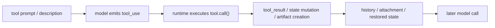

핵심은 tool이 호출되고 끝나는 것이 아니라, 실행 결과가 이후 turn의 context에 다시 연결된다는 점이다. 어떤 결과는 직접 `tool_result`로 다음 모델 호출에 들어가고, 어떤 결과는 attachment나 reminder로 다시 surfaced되며, 어떤 결과는 AppState나 file-backed artifact로 남았다가 필요할 때만 다시 읽힌다.

##### Tool Categories

코드 기준으로 tool은 대략 세 부류로 나눠 이해하는 것이 좋다.

**1. 세계를 바꾸는 tool**

예: `Bash`, `Read`, `Edit`, `Write`, `WebFetch`

이 부류는 파일 시스템, 셸, 네트워크, 문서 등 외부 세계를 직접 읽거나 바꾼다. 결과는 우선 `tool_result`로 돌아오고, 이후 turn에서는 changed files, diagnostics, task notifications 같은 additional context로 다시 surfaced될 수 있다.

**2. 워크플로우를 제어하는 tool**

예: `EnterPlanMode`, `ExitPlanMode`, `TodoWrite`, `TaskCreate`, `TaskUpdate`, `VerifyPlanExecution`

이 부류는 작업 절차 자체를 구조화한다. 단순히 결과를 만드는 것이 아니라, plan file, todo list, task files, verification state 같은 workflow artifact를 생성하고, 이후 turn에서 reminder와 attachment를 통해 다시 모델 입력에 연결한다.

**3. 런타임/대화 자체를 제어하는 tool**

예: `BriefTool`, `REPLTool`, `SleepTool`, `MonitorTool`, `SendMessage`, `TeamCreate`

이 부류는 파일을 바꾸기보다, 세션 운영 방식이나 대화 채널, background execution, 협업 구조 자체를 바꾼다. 이런 tool은 종종 AppState, mode, mailbox, UI channel 같은 런타임 상태를 직접 수정하며, 그 결과는 attachment로 다시 surfaced되기도 하고, 경우에 따라서는 별도의 tool result 없이 UX layer에서만 중요한 의미를 가질 수도 있다.

##### Tool Surfaces

Claude Code의 tool은 대체로 세 가지 surface를 가진다.

**1. Model surface**  
모델이 보는 surface다. tool prompt, input schema, tool_result serialization, attachment reinjection이 여기에 속한다.

**2. Runtime surface**  
실제로 환경이나 상태를 바꾸는 surface다. 예를 들어 file edit, shell execution, task state update, mode transition, mailbox write 등이 여기에 속한다.

**3. UX surface**  
사용자가 보는 surface다. 진행 메시지, tool result UI, condensed transcript, transparent wrapper behavior 등이 여기에 속한다.

중요한 점은 이 세 surface가 항상 같은 내용을 공유하지 않는다는 점이다. 어떤 tool은 모델에게는 짧은 `tool_result`만 남기고, 실제 의미 있는 상태 변화는 runtime에만 남긴다. 반대로 어떤 tool은 attachment나 reminder 형태로 다시 모델 입력에 강하게 반영된다.

##### Tool + Permission + Attachment Integration

Claude Code의 tool 시스템은 permission context, attachment 시스템, reminder/workflow state와 강하게 결합되어 있다.

- permission context는 어떤 tool을 모델에게 노출할지, 실제로 어떤 tool을 실행 가능하게 할지, 어떤 mode에서 어떤 posture로 행동할지를 결정한다.
- attachment 시스템은 tool 실행 결과나 world state 변화를 다음 turn에 적절한 형태로 다시 surfaced한다.
- reminder/workflow state는 tool 사용이 장기 세션에서 끊기지 않도록, plan mode, auto mode, todo/task usage, verification state를 다시 모델 입력에 주입한다.

즉 Claude Code는 tool을 단순 action primitive로 쓰지 않는다. tool, permission, attachment, workflow state를 함께 엮어, 모델이 현재 가능한 행동을 이해하고, 이전 실행 결과를 잊지 않고, 적절한 절차를 유지하면서 작업을 이어가도록 만든다.

##### Summary

Claude Code의 tool 시스템은 "모델이 함수 하나를 호출하는 구조"보다 훨씬 넓다. tool은 capability surface, workflow surface, runtime control surface, UX surface를 동시에 가진다. 그리고 이 tool 시스템은 permission context와 attachment/reinjection 메커니즘과 결합되어, 장기 작업에서도 모델이 상태를 잃지 않고 일관된 방식으로 사용자 요청을 처리하도록 설계되어 있다.

##### BriefTool example

이 관점을 가장 잘 보여주는 사례 중 하나가 `BriefTool`이다. `BriefTool`은 파일을 읽거나 셸 명령을 실행하는 traditional tool이 아니라, 사용자에게 메시지를 전달하는 channel을 제공한다. 즉 tool의 핵심 효과가 world state 변경이 아니라 user-facing communication side effect에 있다.

이 사례가 중요한 이유는, Claude Code에서 tool이 반드시 "외부 환경을 읽거나 바꾸는 함수"일 필요가 없다는 점을 보여주기 때문이다. `BriefTool`은 입력으로 메시지, 첨부 파일, proactive/normal status를 받고, runtime에서는 사용자 채널에 메시지를 전달한다. tool result 자체는 짧은 acknowledgement에 가깝지만, 실제 의미 있는 효과는 사용자-facing surface에서 발생한다.

또한 `BriefTool`은 활성화와 호출이 분리되어 있다. `--brief`, `CLAUDE_CODE_BRIEF`, `defaultView: 'chat'`, `/brief` 같은 경로는 brief mode를 활성화하고 tool availability와 message visibility contract를 바꾸지만, 이것만으로 `BriefTool`이 직접 실행되지는 않는다. 실제 메시지 전달은 여전히 모델이 `SendUserMessage` tool_use를 생성했을 때 normal tool pipeline을 통해 실행된다.

즉 `BriefTool`은 Claude Code가 tool을 단순 action primitive가 아니라, 대화와 런타임을 설계하는 channel abstraction으로도 사용하고 있음을 보여준다. 이 점은 공식 문서에 공개된 stable tool surface만 봐서는 잘 드러나지 않으며, 코드에 존재하는 internal / feature-gated tool들을 통해 더 분명하게 드러난다.

#### Web Reasoning Pipeline

Claude Code에서 웹 정보 접근은 단일 tool 하나로 처리되지 않는다. 대신 `WebSearch`와 `WebFetch`가 서로 다른 역할을 맡는 두 단계 pipeline으로 동작한다.

- `WebSearch`는 최신 정보가 필요한 상황에서 관련 source를 찾고, 후보 URL을 선별하는 역할을 한다.
- `WebFetch`는 선별된 URL의 실제 문서를 읽고, 필요한 정보를 추출해 모델이 사용할 수 있는 형태로 정리하는 역할을 한다.

즉 이 둘은 다음과 같은 관계를 가진다.

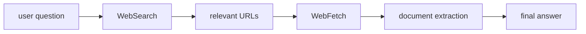

핵심은 semantic quality와 operational quality가 분업되어 있다는 점이다. 검색어 품질, relevance 판단, 문서에서 무엇을 뽑아야 하는지는 주로 모델이 담당하고, Claude Code는 검색 환경, 입력 제약, 결과 구조화, citation discipline, 문서 접근 안전성 같은 운영적 품질을 코드로 강하게 보정한다.

##### WebSearch

`WebSearch`는 단순 검색 API wrapper가 아니다. 메인 모델이 `WebSearch` tool_use를 생성하면, Claude Code는 내부적으로 별도 Claude subquery를 만들어 server-side web search capability를 호출한다. 즉 `WebSearch`는 메인 모델 위에 다시 한 번 search-only query를 감싼 meta-tool에 가깝다.

이 tool에서 고품질 검색어를 만드는 것은 주로 메인 모델의 역할이다. 다만 hardcoded prompt가 다음과 같은 원칙으로 이를 보정한다.

- 모델 지식 cut-off 밖의 정보가 필요할 때만 검색할 것
- 최신 정보, 최근 데이터, 최근 문서, current events처럼 freshness가 중요한 경우에 사용할 것
- 최근 정보를 검색할 때는 현재 연도를 query에 반영할 것
- 필요하면 domain filter를 사용할 것
- 최종 답변에는 반드시 `Sources:` 섹션과 markdown hyperlink를 포함할 것

즉 `WebSearch` prompt는 검색 전략 전체를 직접 하드코딩하지는 않지만, 언제 검색해야 하는지, 그리고 freshness와 citation discipline은 강하게 규정한다.

검색 결과 중 무엇이 relevant한지는 내부 search subquery 모델이 주로 판단한다. 반면 Claude Code는 다음과 같은 구조적 제어를 담당한다.

- `allowed_domains`, `blocked_domains`를 통한 검색 공간 제약
- `max_uses: 8` 제한
- provider/model capability gating
- raw search stream을 summary + links 형태의 normalized tool_result로 재구성
- 메인 모델이 citation을 누락하지 않도록 reminder를 tool_result에 다시 주입

즉 `WebSearch`는 relevance를 직접 계산하는 코드보다, 모델이 relevance를 잘 계산할 수 있게 하는 검색 wrapper로 보는 것이 맞다.

또한 `WebSearch`의 결과는 raw search event stream 그대로 메인 모델에 전달되지 않는다. Claude Code는 search result block과 text summary를 정리해, 메인 모델이 다음 step에서 읽기 쉬운 normalized `tool_result` 형태로 다시 컨텍스트에 주입한다. 따라서 메인 모델은 검색 capability의 내부 이벤트를 직접 보는 것이 아니라, 정리된 검색 abstraction을 다시 입력으로 받는다.

##### WebFetch

`WebFetch`는 특정 URL의 문서를 직접 읽고, 필요한 정보를 추출하는 tool이다. 이 tool의 입력은 단순 URL이 아니라 `url + prompt`의 형태를 가진다. 즉 메인 모델은 어떤 문서를 읽을지뿐 아니라, 그 문서에서 무엇을 추출해야 하는지도 함께 지정한다.

`WebFetch`는 URL을 가져오는 단계에서 단순한 fetch 최적화보다, 법무 리스크, 저작권 리스크, 악성 사이트 접근과 같은 안전성 문제를 함께 제어한다.

예를 들면 다음과 같은 장치가 있다.

- URL validation과 hostname 검증
- HTTP → HTTPS 강제
- domain preflight / blocklist 확인
- 허용되지 않은 redirect 차단
- suspicious domain이나 restricted domain 접근 실패 처리
- binary content를 직접 모델에 던지지 않고 별도 저장 후 제한적으로 노출
- preapproved domain과 일반 domain을 다르게 다룸

이 설계는 `WebFetch`를 단순 문서 읽기 tool이 아니라, 문서 접근의 안전성과 저작권/인용 리스크를 관리하는 guarded fetch tool로 만든다.

실제 문서 내용은 보통 다음처럼 처리된다.

- HTML이면 전체 내용을 markdown으로 변환
- text라면 그대로 사용
- binary라면 파일로 저장하고 필요 시 경로를 함께 남김
- 너무 길면 truncation 적용

즉 `WebFetch`는 보통 문서 전체를 읽되, HTML을 직접 모델에 넘기지 않고 markdown으로 정규화해서 사용한다.

그 다음 대부분의 경우 Claude Code는 이 markdown content를 secondary model에 다시 보낸다. secondary model은:

- fetched markdown content
- 메인 모델이 작성한 extraction prompt
- quoting / usage guideline

을 함께 받아, 문서에서 필요한 정보를 요약하거나 추출한 결과를 만든다.

이 과정에서 일반 domain에는 quote 길이 제한, 과도한 verbatim reproduction 억제, 저작권/콘텐츠 리스크를 줄이기 위한 guideline이 붙는다. 반면 preapproved domain이고 markdown이 충분히 짧은 경우에는, secondary model을 거치지 않고 원문 markdown을 그대로 반환하는 fast path도 존재한다.

즉 `WebFetch`의 일반적인 산출물은 문서를 읽고 정리한 extraction result다.

또한 `WebFetch`의 결과 역시 메인 모델에 raw HTML이나 raw HTTP response로 주입되지 않는다. Claude Code는 fetch 결과를 정규화된 `tool_result`로 만들어 다음 모델 호출의 컨텍스트에 넣는다. 즉 메인 모델은 직접 원문 transport layer를 상대하는 것이 아니라, 정제된 문서 extraction 결과를 다시 입력으로 받는다.

##### Model vs Code Responsibilities

이 pipeline에서 모델과 코드의 역할은 다음처럼 나뉜다.

**모델이 주로 담당하는 부분**

- 검색이 필요한지 판단
- 검색 query 생성
- 검색 결과 relevance 판단
- 어떤 URL을 깊게 읽어야 하는지 결정
- 문서에서 어떤 정보를 추출해야 하는지 결정
- 최종 답변 구성

**코드가 주로 담당하는 부분**

- search-only subquery 환경 생성
- provider/model gating
- domain allow/block
- 검색 횟수 제한
- URL safety / redirect / blocklist 관리
- HTML → markdown 변환
- raw search/fetch 결과를 normalized tool_result로 구조화
- citation discipline과 quote safety를 강제
- 저작권, 법무 리스크, 악성 사이트 접근 리스크를 줄이는 guardrail 적용

즉 semantic quality는 주로 모델이 만들고, Claude Code는 operational quality, 접근 안전성, answer discipline을 코드로 강하게 제어한다.

##### Context Reinjection

이 pipeline의 중요한 특징은 검색과 fetch의 결과가 단순히 한 번 출력되고 끝나지 않는다는 점이다. `WebSearch`와 `WebFetch`의 결과는 모두 정규화된 `tool_result` 형태로 메인 모델의 다음 호출 컨텍스트에 다시 주입된다.

즉 Claude Code는:

- raw search stream
- raw fetched HTML
- raw HTTP response

를 그대로 모델에 다시 주지 않는다. 대신 검색 결과 요약, 링크 후보, 문서 extraction 결과를 모델이 다음 reasoning step에서 바로 사용할 수 있는 형태로 구조화해 컨텍스트에 넣는다.

이 점에서 `WebSearch`와 `WebFetch`는 단순 I/O tool이 아니라, 외부 웹 정보를 모델 친화적인 reasoning artifact로 변환하는 tool chain이라고 볼 수 있다.

##### Summary

`WebSearch`와 `WebFetch`는 각각 breadth와 depth를 담당하는 tool이다.

- `WebSearch`는 최신 source를 찾고 후보를 좁히는 단계다.
- `WebFetch`는 개별 문서를 직접 읽고 필요한 정보를 추출하는 단계다.

Claude Code는 이 둘을 조합해 web reasoning pipeline을 만들고, 모델이 relevance와 extraction을 담당하는 동안, 검색 환경, 문서 접근 안전성, 결과 구조화, citation 및 quote safety 규칙은 코드로 보정한다. 그리고 그 결과는 normalized `tool_result`로 다시 메인 모델 컨텍스트에 주입된다.

따라서 웹 정보 접근의 품질은 모델의 일반 추론 능력만으로 결정되지 않고, Claude Code가 구축한 wrapper, guardrail, reinjection 메커니즘에 의해 함께 결정된다.

##### WebFetch Guardrail

`WebFetch`는 단순한 URL fetch wrapper가 아니다. 이 tool은 웹 문서를 읽을 때 발생할 수 있는 보안, 법무, 저작권, 그리고 컨텍스트 품질 문제를 함께 제어하는 guarded document ingestion tool에 가깝다.

핵심은 `WebFetch`가 단순히 문서를 가져오는 것에 그치지 않고, 어디에 접근할 수 있는지, 어떤 방식으로 따라갈 수 있는지, 읽은 내용을 얼마나 직접 재현할 수 있는지, 그리고 그 결과를 어떤 형식으로 메인 모델에 전달할지를 단계적으로 통제한다는 점이다.

**1. 접근 대상 guardrail**

`WebFetch`는 임의의 URL을 곧바로 읽지 않는다. 먼저 URL validation, hostname 검증, HTTP → HTTPS 업그레이드, domain preflight, blocklist 확인을 거친다. 또한 redirect는 무조건 따라가지 않고, 동일 host 또는 `www.` 추가/삭제 수준의 제한된 redirect만 허용한다.

이 레이어의 목적은 다음과 같다.

- 악성 사이트나 비정상 URL로의 접근 방지
- open redirect를 통한 우회 차단
- 내부적으로 허용되지 않은 도메인 접근 차단
- 평문 HTTP 사용 최소화

즉 `WebFetch`는 URL 입력을 단순 transport target이 아니라, 정책적으로 검증된 접근 대상으로 취급한다.

**2. preapproved domain vs 일반 domain**

코드에는 preapproved domain 목록이 따로 존재한다. 이 목록은 주로 신뢰 가능한 기술 문서, 프로그래밍 레퍼런스, 공식 제품 문서 도메인으로 구성되어 있다. 중요한 점은 이 allowlist가 "WebFetch 전용 GET 접근"에만 적용된다는 것이다. 즉 일반 네트워크 권한이나 sandbox의 unrestricted egress와는 의도적으로 분리되어 있다.

이 설계는 다음 위험을 줄이기 위한 것이다.

- 문서 읽기는 허용하되, 같은 도메인에 대한 임의 업로드나 POST 같은 위험한 동작은 허용하지 않기
- 신뢰된 문서 도메인과 일반 웹 도메인을 같은 수준으로 취급하지 않기
- 기술 문서 접근성과 데이터 유출 위험을 분리해서 관리하기

즉 preapproved domain은 "웹 문서를 읽는 것은 비교적 안전한 도메인"이라는 의미이지, "그 도메인에 대한 모든 네트워크 동작을 허용한다"는 뜻은 아니다.

**3. 법무 / 저작권 guardrail**

`WebFetch`는 문서를 읽은 뒤 secondary model에게 내용을 넘길 때, domain에 따라 다른 quoting / usage guideline을 적용한다.

일반 domain의 경우 다음과 같은 제약이 붙는다.

- quote는 125자 이내로 제한
- 정확한 인용은 quotation marks로 구분
- quotation 밖의 문장은 원문과 word-for-word로 같아지지 않도록 강제
- legality에 대한 판단을 하지 말 것
- song lyrics를 그대로 재현하지 말 것

즉 일반 웹 문서에 대해서는, "읽을 수는 있지만 길게 verbatim reproduction 하지는 말라"는 원칙이 강하게 적용된다. 반면 preapproved domain에서는 code examples나 documentation excerpts를 보다 자유롭게 포함할 수 있다.

이 차이는 `WebFetch`가 문서 접근을 단순한 retrieval이 아니라, 저작권 및 콘텐츠 사용 위험을 고려한 controlled summarization으로 다룬다는 점을 보여준다.

**4. 문서 읽기와 정규화**

`WebFetch`는 문서를 raw HTML 그대로 메인 모델에 넘기지 않는다. 일반적인 경로는 다음과 같다.

- HTML이면 전체 문서를 markdown으로 변환
- text면 그대로 사용
- binary면 파일로 저장하고 경로를 결과에 남김
- 너무 긴 문서는 truncate

즉 실제로 모델이 읽는 것은 보통 HTML 원문이 아니라 markdown으로 정규화된 문서 내용이다. 이 정규화는 이후 extraction 품질을 높이고, raw page noise를 줄이는 역할을 한다.

**5. secondary model과 extraction**

대부분의 경우 `WebFetch`는 fetched markdown content를 secondary model에 다시 보낸다. 이때 secondary model은:

- 정규화된 문서 내용
- 메인 모델이 작성한 extraction prompt
- quoting / usage guideline

을 함께 받고, 그 문서에서 필요한 정보를 요약하거나 추출한 결과를 만든다.

즉 `WebFetch`의 일반적인 산출물은 "원문 문서" 자체가 아니라, 문서를 읽고 정리한 extraction result다. 다만 preapproved domain이고 문서가 충분히 짧은 경우에는, secondary model을 거치지 않고 원문 markdown을 그대로 반환하는 fast path도 존재한다.

**6. 컨텍스트 주입 guardrail**

`WebFetch`의 결과는 raw HTML이나 raw HTTP response로 메인 모델에 다시 전달되지 않는다. Claude Code는 fetch 결과를 정규화된 `tool_result`로 만들어 다음 모델 호출의 컨텍스트에 넣는다.

즉 메인 모델은:

- raw fetched page
- raw binary payload
- raw transport response

를 직접 상대하지 않고, 정제된 extraction result를 다시 입력으로 받는다.

이 점에서 `WebFetch`의 마지막 guardrail은 단순 접근 제어가 아니라, 외부 문서를 메인 모델에 주입하기 전에 reasoning-friendly artifact로 변환하는 것이라고 볼 수 있다.

**Summary**

`WebFetch`의 guardrail은 크게 네 층으로 이해할 수 있다.

- 어디에 접근할 수 있는지 제어하는 도메인/redirect/URL 검증 레이어
- preapproved domain과 일반 domain을 다르게 다루는 신뢰도 레이어
- quote / paraphrase / lyrics 제한을 통한 저작권·법무 리스크 제어 레이어
- raw 문서를 메인 모델에 그대로 넘기지 않고 extraction result로 정규화하는 컨텍스트 주입 레이어

즉 `WebFetch`는 단순 fetch tool이 아니라, 문서 접근, 문서 사용, 문서 재현, 문서 주입을 함께 통제하는 guarded document ingestion tool이다.

#### 선택 노드: compact

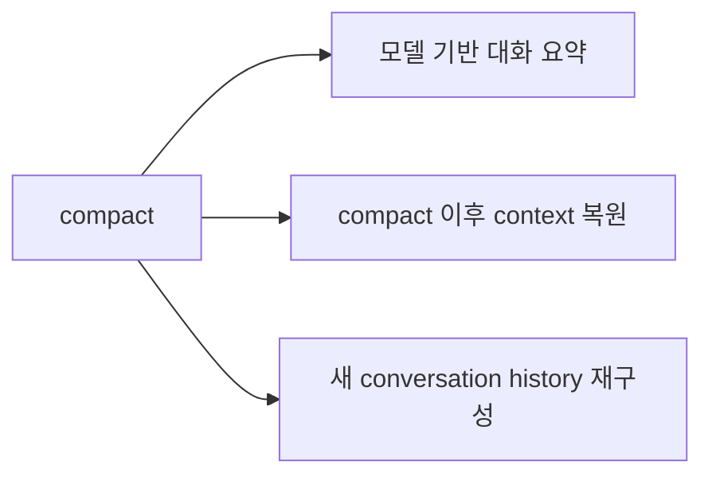

- compact는 기존 대화를 단순 삭제하지 않고, 모델이 대화 summary를 생성하는 방식으로 수행된다.
- summary가 생성되면 compact boundary와 summary message가 만들어진다.
- compact 후에도 이후 작업에 필요한 context를 다시 복원한다.
- 최종적으로 compact 이전 history를 compact 이후 history로 재구성한다.

##### Deterministic Compression Before Model Summarization

Claude Code의 context window 관리에서 중요한 점은, 모든 압축을 곧바로 모델 요약에 맡기지 않는다는 점이다. 오히려 대부분의 경우 먼저 **기계적(deterministic) 압축**을 시도하고, 이 방식으로 충분하지 않을 때만 마지막 단계에서 모델 기반 compact를 수행한다.

여기서 기계적 압축은 의미를 새로 요약하는 것이 아니라, **큰 구조를 더 작은 구조로 바꾸는 것**을 뜻한다.

###### Hardcoded Thresholds

**Tool result budget**

- `DEFAULT_MAX_RESULT_SIZE_CHARS = 50_000`
- `MAX_TOOL_RESULT_TOKENS = 100_000`
- `MAX_TOOL_RESULT_BYTES = 400_000`
- `MAX_TOOL_RESULTS_PER_MESSAGE_CHARS = 200_000`

즉 개별 tool result가 너무 크거나, 한 turn 안의 aggregate tool results가 너무 크면, 전체 본문을 그대로 유지하지 않고 file persistence 또는 preview/placeholder 방식으로 줄인다.

**Time-based microcompact**

- `enabled: false`
- `gapThresholdMinutes: 60`
- `keepRecent: 5`

즉 마지막 main-thread assistant message 이후 60분 이상 지나면, prompt cache가 사실상 만료되었다고 보고 오래된 compactable tool result content를 비운다. 다만 최근 5개는 유지한다.

**Autocompact thresholds**

- `MAX_OUTPUT_TOKENS_FOR_SUMMARY = 20_000`
- `AUTOCOMPACT_BUFFER_TOKENS = 13_000`
- `WARNING_THRESHOLD_BUFFER_TOKENS = 20_000`
- `ERROR_THRESHOLD_BUFFER_TOKENS = 20_000`
- `MANUAL_COMPACT_BUFFER_TOKENS = 3_000`
- `MAX_CONSECUTIVE_AUTOCOMPACT_FAILURES = 3`

즉 Claude Code는 context window 전체를 다 쓰기 전에 일정 buffer를 남기고, 그 buffer 이하로 떨어질 때 compact를 시작한다. 또한 compact가 연속 세 번 실패하면 circuit breaker가 작동해 더 이상 자동 compact를 시도하지 않는다.

**Session memory thresholds**

- `minimumMessageTokensToInit = 10_000`
- `minimumTokensBetweenUpdate = 5_000`
- `toolCallsBetweenUpdates = 3`
- `minTokens = 10_000`
- `minTextBlockMessages = 5`
- `maxTokens = 40_000`

즉 session memory extraction / compaction도 token growth와 tool call cadence를 기준으로 제한적으로 발동한다.

###### Concrete Deterministic Compression Methods

- 큰 tool result는 전체 본문을 남기지 않고, 파일로 저장한 뒤 preview 또는 reference로 치환한다.
- 오래된 tool result는 semantic summary가 아니라 placeholder로 대체된다.
- cached microcompact는 transcript를 다시 쓰지 않고, cache editing API를 통해 오래된 tool results를 prompt cache prefix에서 제거한다.
- `normalizeMessagesForAPI(...)`는 연속 user message merge, assistant fragment merge, progress/system/virtual message 제거, orphaned tool_result strip 등을 수행한다.
- context collapse는 full transcript를 직접 삭제하지 않고, model-facing collapsed view만 만든다.

###### Hardcoded Compression Markers

기계적 압축은 실제 payload를 아래 같은 고정 문자열로 바꾼다.

```text
<persisted-output>
Output too large (<size>). Full output saved to: <filepath>

Preview (first 2000 bytes):
<preview text>
...
</persisted-output>
```

```text
[Old tool result content cleared]
```

```text
(<toolName> completed with no output)
```

```text
[Content truncated due to length...]
```

즉 Claude Code의 기계적 압축은 semantic summary가 아니라, **reference / preview / placeholder 문자열로 payload를 줄이는 방식**이다.

###### Summary

Claude Code는 "압축 = 요약"으로 보지 않는다. 먼저 **구조적으로 줄일 수 있는 것은 기계적으로 줄이고**, 정말 필요할 때만 하드코딩된 compact prompt를 통해 모델 기반 summary를 수행한다.

##### 선택 노드: compact 이후 context 복원

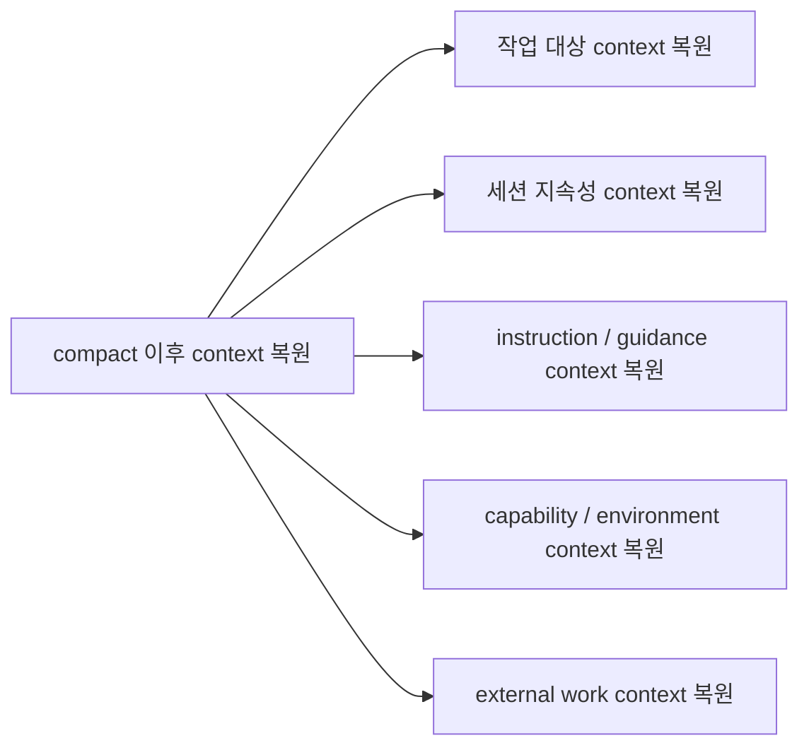

compact 이후 context 복원은 compact 로직에서 가장 중요한 부분 중 하나다.
이 단계가 중요한 이유는 compact가 단순히 "요약만 남기는 작업"이 아니라는 점을 보여주기 때문이다.

핵심은 이렇다.

compact는 대화를 줄이지만, 이후 작업을 계속할 수 있을 만큼의 운영 맥락은 다시 채워 넣는다.

summary만으로는 충분하지 않다.
summary는 "무슨 일이 있었는지"는 알려주지만,
"지금 이 세션이 어떤 상태로 계속되어야 하는지"까지는 충분히 보장하지 못한다.

그래서 compact 이후에는 summary로 대체되지 않는 실행용 context를 다시 복원한다.
이 context는 역할 기준으로 다음과 같이 나눌 수 있다.

1. 작업 대상에 대한 context
compact 후에도 모델은 지금 어떤 파일, 산출물, 플랜을 계속 다뤄야 하는지 알아야 한다.
예를 들면 최근 작업 파일, plan 관련 정보, 현재 작업 단서가 되는 파일/상태가 여기에 포함된다.
이 context가 필요한 이유는, summary만으로는 "무엇을 했는지"는 알 수 있어도 "지금 어떤 대상을 기준으로 다음 행동을 해야 하는지"는 약해질 수 있기 때문이다.

2. 세션 지속성 context
compact 이후에도 세션은 compact 전과 같은 세션으로 이어져야 한다.
예를 들면 plan mode 상태, auto mode 상태, compact 이전에 이미 알려졌던 도구/에이전트/설정 관련 상태가 여기에 해당한다.
이 context가 필요한 이유는 compact가 발생했다고 해서 세션의 운영 모드가 초기화되면 안 되기 때문이다.

3. instruction / guidance context
compact 이후에도 모델이 계속 따라야 할 지시 계층은 다시 살아 있어야 한다.
예를 들면 CLAUDE.md 계열 instruction, session start 성격의 재주입 컨텍스트, compact 후 다시 읽혀야 하는 규칙/메모리가 포함된다.
이 context가 필요한 이유는 summary는 과거 대화 요약이지, 현재 적용 중인 지시 체계의 원본이 아니기 때문이다.

4. capability / environment context
compact 후에도 모델은 어떤 도구와 환경을 사용할 수 있는지 계속 알아야 한다.
예를 들면 도구 목록 변화, MCP instruction/state, skill 관련 상태, agent listing, deferred tool state가 여기에 포함된다.
이 context가 필요한 이유는 summary만으로는 "현재 무엇을 쓸 수 있는지"가 최신 상태로 보장되지 않기 때문이다.

5. asynchronous / external work context
세션 바깥에서 계속 진행 중인 작업이나 비동기 상태에 대한 맥락도 유지되어야 한다.
예를 들면 async agent 상태, queued 상태성 정보, 외부 진행 중 작업과의 연결 정보가 여기에 해당한다.
이 context가 필요한 이유는 compact가 일어나도 백그라운드 작업이나 팀/에이전트 상태가 사라지면 안 되기 때문이다.

요약하면, compact 이후 context 복원은 summary만으로는 유지되지 않는 실행 가능한 세션 상태를 다시 채워 넣는 단계다.

## Notes

- 이 다이어그램은 코드 세부 구현이 아니라 분석용 상위 프레임이다.
- 실제 코드에서는 단계 경계가 일부 겹친다.
- 특히 실제 구현에서는 일부 rewrite/정규화 로직이 이후 단계와 맞물릴 수 있다.
- 이후 분석은 이 추상화를 유지하되, 필요하면 용어나 경계를 수정한다.

## Next Questions

- `쿼리 전처리`는 코드상 어디서 시작해서 어디서 끝나는가?
- `컨텍스트 조립`에는 어떤 데이터가 포함되는가?
- `에이전틱 루프`는 어떤 조건에서 반복되는가?
- `응답`은 어떤 이벤트 단위로 UI에 반영되는가?
- `CLAUDE.md` 는 context window 에 어떻게 머지 되는가?

## Appendix

### Built-in Tool Registry

아래 목록은 `getAllBaseTools()` 기준의 registry-level built-in tool 목록이다. 실제 세션에서 모델에게 노출되는 tool set은 feature flag, env/platform, interactive 여부, permission context, `isEnabled()` 결과에 따라 이보다 더 작아질 수 있다.

#### Core / 일반 tools

- `Agent`
- `TaskOutput`
- `Bash`
- `Glob`
- `Grep`
- `ExitPlanMode`
- `FileRead`
- `FileEdit`
- `FileWrite`
- `NotebookEdit`
- `WebFetch`
- `TodoWrite`
- `WebSearch`
- `TaskStop`
- `AskUserQuestion`
- `Skill`
- `EnterPlanMode`

#### Task / workflow tools

- `TaskCreate`
- `TaskGet`
- `TaskUpdate`
- `TaskList`
- `VerifyPlanExecution`

#### Worktree tools

- `EnterWorktree`
- `ExitWorktree`

#### MCP / discovery tools

- `ListMcpResourcesTool`
- `ReadMcpResourceTool`
- `ToolSearch`

#### Communication / runtime / orchestration tools

- `Brief`
- `SendMessage`
- `REPL`
- `Workflow`
- `Sleep`
- `Monitor`
- `RemoteTrigger`
- `PushNotification`
- `SubscribePR`
- `SendUserFile`
- `TerminalCapture`
- `CtxInspect`
- `Snip`

#### Platform / environment / experimental tools

- `Config`
- `Tungsten`
- `PowerShell`
- `WebBrowser`
- `SuggestBackgroundPR`
- `ListPeers`

#### Team / swarm tools

- `TeamCreate`
- `TeamDelete`

#### Cron / scheduling tools

- `CronCreate`
- `CronDelete`
- `CronList`

#### Test / internal tools

- `OverflowTest`
- `TestingPermission`
